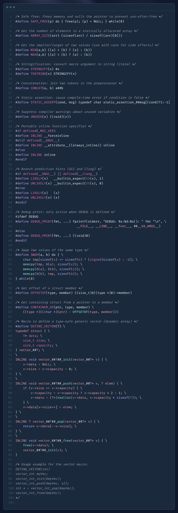

# C Programming

## LowLevelCode Zero2Hero C course

### Compilation Process

The process of converting source code to machine code is the following steps.

- Preprocessor
- Compilation
- Assembly
- Linking

### Strings

Strings are special. A string in C has a very special characteristic that makes it amazing, but also dangerous. 
All strings in C are ended with a null byte. If they don't end in a null byte, the operation you'll performing will complete going.

Why does that matter? If you run operations like strcpy, which copies data from the src buffer to the dest buffer. 
It will ONLY STOP COPYING OR PRINTING IF IT ENCOUNTERS THAT ZERO BYTE. So, the code above actually has a pretty major security vulnerability. 
You have to make sure your strings end with a zero, otherwise things will go sideways.

### Structure

If wanted to serialize this data and work on it between two different systems that might have different architectures, 
there's a chance that the structures may change between these systems. By adding special modifiers to the structures, 
we can ensure that the structure does not get modified in this way.

You can create a structure with the following syntax.

```c
struct mystruct {
    int i;
    char c;
};
```

Here, the structure should only be 5 bytes. But, there is a high chance that the structure is actually 8 bytes, or even 16 bytes due to alignment issues.

To fix this, we can add the packed attribute.

```c
struct __attribute__((__packed__)) mystruct {
    int i;
    char c;
};
```

This will create the same struct, but ensure that the compiler doesn't add any special sauce in between the elements 
so we can ensure it's the same size on multiple systems.

### Union

Unions are a field that assign multiple labels of multiple types to the same memory location.

You can create a structure with the following syntax.

```c
union myunion {
    int i;
    char c;
};
```

This will create a type called union myunion that we can use later on in the code. 
This structure has two members i and c, but both of them will contain data at the same location. 
The union is only the size of the largest element, in this case int i, or 4 bytes.

```c
union myunion {
    int i;
    char c;
};

int main() {
    union myunion u;
    u.i = 0x41424344;
    printf("%c"\n, u.c); 
    ...
}
```

Above, u.c will equal 0x44, which is the value in the location of i.

### Pointers

A pointer is a variable who's value equals the address of another variable.

To make a variable, first you need another variable that you want to point to. 
Lets say we have an integer that we'd like to reference.

```c
int x = 3;
```

To create a pointer that points to x, all we'd have to do is create a pointer and set it's value 
equal to the address of x. We can do that with the following syntax.

```c
int x = 3;
int *pX = &x;
```

Here, the syntax is as follows. The * character notes that the type is a pointer. 
The & character gets the "address of", which gets the address of x and puts that value in pX.

To use a pointer, all you have to do is "dereference" it. To dereference a pointer, 
simply add the * to the name of the pointer to get the value at that location.

```c
int x = 3;
int *pX = &x;
printf("%d\n", *pX);
```

## Dynamic Memory Allocation

In previous examples we showed how to allocate memory via an array or create memory space using structures. 
The problem with both of these solutions to allocating memory is that their sizes are static, 
and have to be known at compile time. Because of this, we end up allocating too much space and 
not being able to allocate any more if our program grows.

### The Heap

The heap is a data region in ELF (Linux) memory that is managed by a memory allocator. 
Instead of using statically defined arrays or structures, we can ask the memory allocator 
via a function called malloc to get us a certain amount of memory. For example: this code 
allocates 64 bytes of memory.

```c
malloc(64);
```

### Allocating Memory

To use this memory, we need to assign it to variable for use later. Also, its important that 
we check the return value from malloc to make sure that we got a value from the allocator. 
Sometimes, allocators fail.

```c
struct employee_t *my_employee = malloc(sizeof(struct employee_t));
if (my_employee == NULL) {
    printf("Something went wrong\n");
    return -1;
}
```

### Freeing Memory

We MUST give the memory back to the system. If we fail to free memory that we allocate, 
over time we will leak memory, and could possibly use up all available system memory and 
eventually have our process be killed by the operating system kernel. 
To avoid this, free your memory like so:

```c
...
free(my_employee);
my_employee = NULL;
```

It's not required, but always a smart idea to set used pointers to NULL. By setting pointers to NULL, 
we avoid what is called a dangling pointer, or a pointer that points to memory that is no longer valid.

## Static Memory Allocation

Sometimes we want data to exist in the scope of the lifetime of our entire program. 
For example, what if we want to track the amount of employees that have been initialized in our database 
so far? We have two options: global and static variables.

### Static Variables

A static variable is a variable that exists in a static lifetime, but does not have global scope. 
By creating a static variable, we are able to create variables that out live the lifetime of a function 
call and track data over multiple calls to the same function.

```c
int my_static_test() {
    static int i = 0;
    i++;
}
```

In the above function, i will be set to zero the first time the function is ran. When this happens,
the variable's data is actually stored not on the stack, but somewhere in the data section of the 
program that is running. Later calls to my_static_test will increase the variable every time, 
so it will be 1, then 2, then 3

**Static Use Case**

Let's say for example we wanted to track how many times a particular function was called, maybe the employee_initialize function for example.

```c
int employee_initialize (employee_t) {
    static int n_called = 0;
    ...
    
    return n_called++;
}
```

The above code will increment the variable every time the employee_initialize function was called, and return the current value to the user.
The idea is that when we declare a static var we initialize it in **global** scope but only we have access to it as opposed to a global variable.

### Pointers to pointers

A double pointer is a pointer that points to another pointer. In memory management, double pointers are particularly useful for functions that need to modify the original pointer, such as allocating or resizing dynamic memory.

#### Using Double Pointers with realloc

We want to create a function foo that resizes an array using realloc. The function should accept a double pointer to the array so that it can modify the original pointer.

```c
#include <stdio.h>
#include <stdlib.h>

typedef enum {
	STATUS_GOOD,
	STATUS_BAD,
} status_t;

status_t foo(int **arr, size_t new_size) {
    int *temp = realloc(*arr, new_size * sizeof(int));
    if (temp == NULL) {
        // Handle realloc failure
        printf("Memory allocation failed\n");
        return STATUS_BAD;
    }
    *arr = temp;
    return STATUS_GOOD;
}

int main() {
    size_t initial_size = 5;
    size_t new_size = 10;

    int *arr = malloc(initial_size * sizeof(int));
    if (arr == NULL) {
        printf("Memory allocation failed\n");
        return 1;
    }

    // Initialize the array
    for (size_t i = 0; i < initial_size; i++) {
        arr[i] = i;
    }

    // Print the initial array
    printf("Initial array:\n");
    for (size_t i = 0; i < initial_size; i++) {
        printf("%d ", arr[i]);
    }
    printf("\n");

    // Call foo to resize the array
    if (STATUS_BAD == foo(&arr, new_size)) {
		printf("uh oh");
		return -1;
	}

    // Initialize the new part of the array
    for (size_t i = initial_size; i < new_size; i++) {
        arr[i] = i;
    }

    // Print the resized array
    printf("Resized array:\n");
    for (size_t i = 0; i < new_size; i++) {
        printf("%d ", arr[i]);
    }
    printf("\n");

    free(arr);
    return 0;
}
```

1. Function Definition:

    - ```void foo(int **arr, size_t new_size)```: The function foo takes a double pointer arr and a new size new_size as parameters.

2. Reallocating Memory:

    - int ```*temp = realloc(*arr, new_size * sizeof(int));```: The ```realloc``` function attempts to resize the memory block pointed to by ```*arr``` to ```new_size``` elements.

    - If ```realloc``` fails, it returns ```NULL```. The original memory block is not freed in this case.

    - ```if (temp == NULL)```: Check if ```realloc``` failed.

    - ```*arr = temp;```: If ```realloc``` is successful, update the original pointer ```*arr``` to point to the new memory block.

3. Main Function:

    - Allocate initial memory using ```malloc```.
    - Initialize and print the initial array.
    - Call ```foo``` to resize the array.
    - Initialize and print the resized array.
    - Free the allocated memory.

Double pointers are essential in C for functions that need to modify the original pointer, such as those that allocate or resize dynamic memory. This lesson demonstrated how to use double pointers with ```realloc``` to resize an array in a function.

The idea is that C is pass by value. If we just pass a pointer to a function we basically pass a copy of the original pointer(address). If we pass a pointer to the
original pointer then we can change the original address.

**Visual Analogy**

Imagine a piece of paper (pointer) with an address written on it.

    - Without double pointer: You give someone a photocopy of the paper. They scribble a new address on the copy. Your original paper remains unchanged.
    - With double pointer: You give someone the location of your paper. They can directly edit the original address on your paper.

### Testing for Memory Leaks

#### Valgrind

Valgrind is a program that wraps the calls to malloc and free, tags them, and checks to see where memory is leaked or potentially lost.

To make your code compatible with valgrind, you'll need to compile with debug symbols in your code. Do this the following way.

```bash
gcc -o program code.c -g
```

The -g flag will add the debug symbols to your code. To test your code, run:

```bash
valgrind --leak-check=full ./program
```

Valgrind will run your code and provide a report of what memory did not get freed, and where the allocation happened.

Please note that you need to write tests to make your code execute lines that allocate from the heap to use valgrind correctly. 
If your code never allocates from the heap in your test case, it'll never see the memory leak.

### Glibc

Glibc, or the GNU C library, is the library that gets baked into every program you compile with gcc.

When we write code, we write userland code, or code that exists in the context of a userspace process. To the CPU, this code is unpriveleged, 
and as a result it can't really do anything fancy, like allocate memory, access the filesystem, or access the network.

To do privleged things, we ask the kernel (which runs as privleged code) to do it for us. This is done through what is called a "system call interface" 
where the syscall instruction is ran, and asks the kernel to perform a certain action.

The GNU C library cleanly wraps all of this functionality up into easy to use functions that wrap the otherwise hard to maintain system call functionality.

For example, when we allocate memory from the kernel for our process, we use malloc. Malloc internally calls the sbrk or mmap system calls, 
which asks the kernel through a system call to give us more memory. All of this abstracted away from us as the developer, 
and all we have to do is managed the result.

To see what libraries your program is linked against, try:

```bash
ldd ./myprogram
```

To check the documentation for functions in Glibc we need to use ```man <function_name>```. If the returned documentation is not for a function (could be a desc
of some OS thing) then use ```man 2 <function_name>```.

### File Descriptors

In Linux, every program you run has three file descriptors open by default

    - 0: stdin - a file that represents the input to your program from the command line
    - 1: stdout - a file that represents the output of your program to the command line
    - 2: stderr - a file that represents the output of your program, but containing only errors

### File Output

To write to a file, we need to first open the file. We do this using the open libc function to get a file descriptor to that file. 
We'll use that file descriptor in later functions to describe to the kernel what file we want to perform that action on.

#### open

To open a file, we specify the path that we want to open, as well as the type of open operation that we want to do. All of the types are described in the man page.

```c
...
int fd = open("./a-file", O_RDWR | O_CREAT, 0644);
if (fd == -1) {
    perror("open");
    return -1;
}
...
```

In the above code, we're asking the kernel to open the file ./a-file. 
If the file does not exist, create the file. Open it read write, with the linux octal permissions 0644, or rw-r--r-.

#### write

With the file open and the descriptor checked to be a valid value, we can use that descriptor in other functions. For example, write.

```c
char *a_buf = "some data\n";
write(fd, a_buf, strlen(a_buf));
```

The above function uses the descriptor from before, and writes the buffer at a_buf to that location. Doing this, we can check the file to see the contents.

### File Input

To read from a file, just like before we need to first open the file. We do this using the open libc function to get a file descriptor to that file.

```c
...
int fd = open("./my-db.db", O_RDONLY);
if (fd == -1) {
    perror("open");
    return -1;
}
...
```

#### read

With the file open and the descriptor checked to be a valid value, we can use that descriptor in other functions. 
For example, read. Here, we can use read to read the contents of that file into our database header. 
This is really cool, because instead of reading in some data and then converting the data, we can write it directly 
into our header structure and check the data.

```c
struct database_header head = {0};
...
read(fd, &head, sizeof(head));
printf("Database Version %d", head.version);
```

### Reading File Metadata

#### stat

stat is a linux system call that asks the kernel to report information about a specific file. To learn more about the specific details of stat, try man stat.

```bash
stat ./my-db.db
```

#### Validating User Input

We can use the stat family of functions, specifically fstat to check what the kernel has to say about the file, and then confirm that the metadata reported in the file head is the same.

```c
...
struct stat dbstat = {0};
if (fstat(fd, &stat) < 0) {
    perror("fstat");
    close(fd);
    return -1;
}
...
if (stat.st_size != head.size) {
    printf("HACKER DETECTED!\n");
    close(fd);
    return -1;
}
```

### Variable Types

#### Types

Here are the common types, their bit length, their signedness, and the associated size.

**C Data Type: char**

- Signed/Unsigned: Signed
- Bit Length: 8 bits
- Minimum Value: -128
- Maximum Value: 127

**C Data Type: unsigned char**

- Signed/Unsigned: Unsigned
- Bit Length: 8 bits
- Minimum Value: 0
- Maximum Value: 255

**C Data Type: short**

- Signed/Unsigned: Signed
- Bit Length: 16 bits
- Minimum Value: -32,768
- Maximum Value: 32,767

**C Data Type: unsigned short**

- Signed/Unsigned: Unsigned
- Bit Length: 16 bits
- Minimum Value: 0
- Maximum Value: 65,535

**C Data Type: int**

- Signed/Unsigned: Signed
- Bit Length: 16 or 32 bits
- Minimum Value: -2,147,483,648 (32-bit)
- Maximum Value: 2,147,483,647 (32-bit)

**C Data Type: unsigned int**

- Signed/Unsigned: Unsigned
- Bit Length: 16 or 32 bits
- Minimum Value: 0
- Maximum Value: 4,294,967,295 (32-bit)

**C Data Type: long**

- Signed/Unsigned: Signed
- Bit Length: 32 bits
- Minimum Value: -2,147,483,648
- Maximum Value: 2,147,483,647

**C Data Type: unsigned long**

- Signed/Unsigned: Unsigned
- Bit Length: 32 bits
- Minimum Value: 0
- Maximum Value: 4,294,967,295

**C Data Type: long long**

- Signed/Unsigned: Signed
- Bit Length: 64 bits
- Minimum Value: -9,223,372,036,854,775,808
- Maximum Value: 9,223,372,036,854,775,807

**C Data Type: unsigned long long**

- Signed/Unsigned: Unsigned
- Bit Length: 64 bits
- Minimum Value: 0
- Maximum Value: 18,446,744,073,709,551,615

**C Data Type: float**

- Bit Length: 32 bits
- Minimum Value: ~ -3.4 x 10^38
- Maximum Value: ~ 3.4 x 10^38

**C Data Type: double**

- Bit Length: 64 bits
- Minimum Value: ~ -1.7 x 10^308
- Maximum Value: ~ 1.7 x 10^308

### Type Casting

To type cast a variable, you do the following expression.

```c
int other_var = -1;
unsigned int x = (unsigned int)other_var;
```

However, typecasting variables of different types has effects on the variables that is important to understand.

#### Signedness Casting

```c
int other_var = -1;
unsigned int x = (unsigned int)other_var;
```

In this example, we cast a negative value to an unsigned value. It's important to understand under the hood how signedness will effect the value of this variable in an unsigned fashion. For example, -1 becomes MAX_INT in the following value.

#### Up Casting

```c
short other_var = -1;
int x = (unsigned int)other_var;
```

When you cast up a variable from one size to a larger size, the signedness comes with it. For example, here, despite shorts being 16 bits and integers being 32 bits, the value -1 will be sign extended through the larger variable.

#### Down Casting

```c
int x = 0xfffffefe;
short other_var = (short)int;
```

When you cast a larger variable to a smaller variable, the number will be truncated because you cannot fit the entire size of the larger variable into the smaller variable.

#### Floats

```c
float f = 3.14
int wasafloat = (int)f;
```

Floats or doubles can be cast to other variable types. It's important to understand that under the hood, assembly instructions are generated in the FPU of the processor to execute this conversion. In other casts, the data has not been significantly manipulated to enable the cast. In this case, the IEEE704 type must be manipulated to reveal the scalar value.

### Multi Module Programming

#### Modules 

We can think of our database project as a set of modules that interfaces with the user. Maybe we have:

- the main module: interfaces via stdin and stdout
- the file module: interfaces with the main module via an exposed interface and the filesystem
- the parsing module: reads data from opened files and parses them for the user

#### Header Files

Interfaces between the main module and the other modules are exposed in header files. Header files reveal the declarations, but not necesarily the definitions, for functions that we use in a module. Inside of a C file for a module, we will define the function, but the main module does not need to know about the internal functionality: just the inputs and outputs.

A sample header file could be:

```c
#ifndef FILE_H
#define FILE_H

int open_rw_file(char *path);

#endif
```

In this file, file.h, we expose the interface to the file module, without giving the definition of the function. To access these functions, we use headers in main.c

```c
...
#include "file.h"
```

### Build Systems

#### Make

make is a tool that, when ran, finds a local Makefile and executes the instructions to build a particular target.

Makefiles are organized around targets, rules, and instructions

```make
TARGET = bin/final
SRC = $(wildcard src/*.c)
OBJ = $(patsubst src/%.c, obj/%.o, $(SRC))

default: $(TARGET)
```

Here, default is a target, that says to be complete, first the $(TARGET) binary must be complete. Once that is complete, the instructions within default will be ran.

Make will take this logic forward and recursively run the functionality in the Makefile until the target is met.

```make
TARGET = bin/final
SRC = $(wildcard src/*.c)
OBJ = $(patsubst src/%.c, obj/%.o, $(SRC))

default: $(TARGET)

clean:
	rm -f obj/*.o
	rm -f bin/*

$(TARGET): $(OBJ)
	gcc -o $@ $?

obj/%.o : src/%.c
	gcc -c $< -o $@ -Iinclude
```

Wildcard will capture all of our source files as a list in src/

Patsubst will execute a pattern substitution and convert all src/\*.c to obj/\*.o

#### Symbols

- $? represents a list of all input files given as a target
- $< represents a single file given as a target
- $@ represents the target of the rule

### Creating Libraries

A library is a piece of code that is portable as either a static object or a shared object.

#### Static Object

A static object, static library, or .a file is a set of intermediate ELF files that are compiled into your program at compile time. 
The benefit of a static object is that the code is transported inside your final product, you don't need to ship additional libraries. 
The downside is that your binary will increase in size as code is not shared amongst other processes.

#### Compiling

```bash
# compiling the library
gcc -o libteehee.o -c ./lib.c
ar rcs libteehee.a libteehee.o

# adding the library to a project
gcc -o main main.c libteehee.a
```

#### Shared Object

A shared object, shared library, or .so file is a compiled ELF file that is linked into your program at run time. 
The benefit of a shared object is that the code is transported outside your final product meaning your ELF will be smaller 
without the duplicated code inside. However, this means that for your code to run, you will need to install the library in 
the system root library directory, such as /lib or /usr/lib.

```bash
# compiling the library
gcc -o -shared libteehee.so ./lib.c

# adding the library to a project
gcc -o main main.c -lteehee -L$(pwd)/lib
```

### Creating a Unix Command Line Utility with Getopt

Using the getopt library in the following loop, we can parse the command line arguments passed to our program to capture the intent from the user.

```c
#include <getopt.h>

int main(int argc, char *argv[]) {
	int c = 0;

	while ((c = getopt(argc, argv, "nf:") != -1) {
		switch(c) {
			case 'f':
				...
				break;
			case 'n':
				...
				break;
		}
	}
}
```

Based on this, no we can use flags like -n or -f in our program and execute logic based on those flags!

## Cheatsheet

  

## Data Types

- char c = 'A'; // single character | 1 byte (-128 to 127) | unsigned char (0 to 255)
- char str[] = "Hello"; // array of characters | string

- float f = 3.14; // 4 bytes (32 bits of precision) | 6-7 decimal digits | loses precision after 7 digits
- double d = 3.14; // 8 bytes (64 bits of precision) | 15-16 decimal digits | loses precision after 16 digits

- bool b = true; // 1 byte (0 or 1) | true or false | need to include stdbool.h

- short int si; // 2 bytes (-32,768 to 32,767)
- unsigned short int usi; // 2 bytes (0 to 65,535)

- int i; // 4 bytes (-2,147,483,648 to 2,147,483,647)
- unsigned int ui; // 4 bytes (0 to 4,294,967,295)

- long long int lli; // 8 bytes (-9,223,372,036,854,775,808 to 9,223,372,036,854,775,807)
- unsigned long long int ulli; // 8 bytes (0 to 18,446,744,073,709,551,615)

- defining a constant is done by using the const keyword

- Math library (#include <math.h>, compile with -lm) prefers double.

    const float PI = 3.14;

| Name      | Size    | Description                                           |
|-----------|---------|-------------------------------------------------------|
| char      | 1 byte  | an ASCII value: e.g. 'a' (see: man ascii)             |
| int/long  | 4 bytes | a signed integer: e.g. 97 or hex 0x61, oct 0141       |
| long long | 8 bytes | a longer multi-byte signed integer                    |
| float     | 4 bytes | a floating-point (possibly fractional) value          |
| double    | 8 bytes | a double length float                                 |

## Casting

Preceding a primitive expression with an alternate parenthesized type converts or "casts" value to a new value equivalent in new type:

```c
int a = (int) 3.131;   //assigns a=3 without complaint
```

Preceding any other expression with a cast forces new type for unchanged value.

```c
double b = 3.131;
int a = *(int*)&b; //interprets the double b as an integer (not necessarily 3)
```

## STRUCTS and ARRAYS and POINTERS and ADDRESS COMPUTATION:

### Structs

Collect several fields into a single logical type:

```c
struct { int n; double root;} s; //s has two fields, n and root
s.root = sqrt((s.n=7)); //ref fields (N.B. double parens=>assign OK!)
```

Basic struct definition and initialization:

```c
struct Point {
    int x;
    int y;
};

struct Point p1 = {10, 20}; // Initialize at declaration
struct Point p2;
p2.x = 30;
p2.y = 40;

printf("p1: (%d, %d)\n", p1.x, p1.y);
printf("p2: (%d, %d)\n", p2.x, p2.y);
```

Nested structs:

```c
struct Rectangle {
    struct Point top_left;
    struct Point bottom_right;
};

struct Rectangle rect = {{0, 0}, {100, 100}};
printf("Rectangle: (%d,%d) to (%d,%d)\n", 
       rect.top_left.x, rect.top_left.y, 
       rect.bottom_right.x, rect.bottom_right.y);
```

Array of structs:

```c
struct Student {
    char name[50];
    int age;
    float gpa;
};

struct Student class[3] = {
    {"Alice", 20, 3.8},
    {"Bob", 22, 3.5},
    {"Charlie", 21, 3.9}
};

for (int i = 0; i < 3; i++) {
    printf("Student %d: %s, Age: %d, GPA: %.1f\n", 
           i+1, class[i].name, class[i].age, class[i].gpa);
}
```


