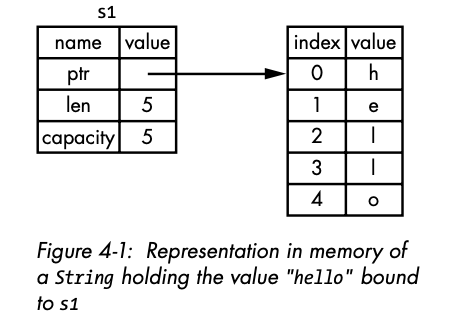
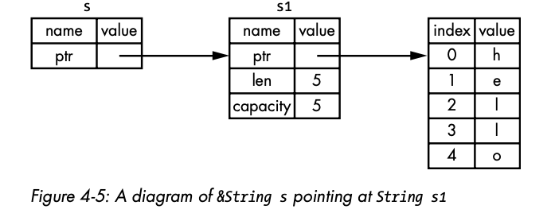
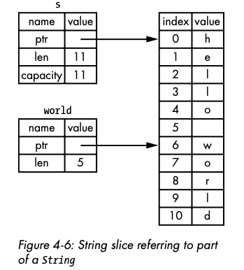

# Rust programming language

## 1. Variables

- By default variables are mutable. 
- Adding `mut` to a variable makes it mutable.

```rust
let mut x = 7;
```
- Constants are also immutable, but unlike vars they can't be made mutable. The
data type of constants MUST be annotated. 

```rust
const THREE_HOURS_IN_SECONDS: u32 = 60 * 60 * 3;
```

- Constants expressions can be evaluated at compile time.

### Shadowing

- When declaring a new variable with the name of a previous variable, the second
variable overshadows the first, the Rust compiler will only use the second. That
is called `Shadowing`.

## 2. Data Types

### Scalar Types

- A scalar type represents a single value. Rust has 4 primary scalar types:
integers, floating-point numbers, Booleans and characters.

**Integer Types**

| Length | Signed | Unsigned |
|--------|--------|----------|
| 8-bit  | i8     | u8       |
| 16-bit | i16    | u16      |
| 32-bit | i32    | u32      |
| 64-bit | i64    | u64      |
| 128-bit| i128   | u128     |
| arch   | isize  | usize    |
---

- Each signed variant can store numbers from –(2n – 1) to 2n – 1 inclusive,
where n is the number of bits that variant uses. So an i8 can store numbers
from –(27) to 27 – 1, which equals –128 to 127.

- The isize and usize types depend on the architecture of
the computer your program is running on, which is denoted in the table
as “arch”: 64 bits if you’re on a 64-bit architecture and 32 bits if you’re on a
32-bit architecture.

- Number literals can also use ```-``` asa visual separator to make the number 
easier to read, such as 1_000, whichwill have the same value as if you had 
specified 1000.

| Number literals | Example |
|----------------|---------|
| Decimal        | 98_222  |
| Hex            | 0xff    |
| Octal          | 0o77    |
| Binary         | 0b1111_0000 |
| Byte (u8 only) | b'A'    |
---

- Rust performs two’s complement wrapping.

- To explicitly handle the possibility of overflow, you can use these families
of methods provided by the standard library for primitive numeric types:

    - Wrap in all modes with the wrapping_* methods, such as wrapping_add.
    - Return the None value if there is overflow with the checked_* methods.
    - Return the value and a Boolean indicating whether there was overflow with
the overflowing_* methods.
    - Saturate at the value’s minimum or maximum values with the saturating_*
methods.

**Floating-Point Types**

- Rust’s floating-point types are f32 and f64, which are 32 bits and 64 bits 
in size, respectively.
- All floating-point types are signed.

**Numeric Operations**

- Integer division truncates toward zero to the nearest integer.

```rust
fn main() {
    // addition
    let sum = 5 + 10;
    // subtraction
    let difference = 95.5 - 4.3;
    // multiplication
    let product = 4 * 30;
    // division
    let quotient = 56.7 / 32.2;
    let truncated = -5 / 3; // Results in -1
    // remainder
    let remainder = 43 % 5;
}
```

**The Character Type**

- Rust’s char type is four bytes in size and represents a Unicode scalar value, 
which means it can represent a lot more than just ASCII. Accented letters; 
Chinese, Japanese, and Korean characters; emoji; and zero-width spaces are all 
valid char values in Rust. 
- Unicode scalar values range from U+0000 to U+D7FF and U+E000 to U+10FFFF 
inclusive.

In Rust, there are several ways to declare and create a String. The String type is a growable, heap-allocated data structure that owns its contents, as opposed to string literals (&str) which are fixed-size and often stored in the program's read-only memory.

### Creating Strings in Rust

**Using String::from()**

The most common way to create a String is by using the `String::from()` method, which converts a string literal into an owned String:

```rust
let word = String::from("Hello, World!");
```

This creates a new String with the content "Hello, World!" and assigns it to the variable `word`.

**Using to_string() Method**

Another common approach is to use the `to_string()` method, which is available on any type that 
implements the `Display` trait, including string literals:

```rust
let greeting = "Hello, Rust!".to_string();
```

This converts the string literal into an owned String.

**Using String::new()**

You can create an empty String and then add content to it later:

```rust
let mut empty_string = String::new();
empty_string.push_str("Adding content");
```

This creates a new empty String and then appends text to it.

**Using String::with_capacity()**

If you know the approximate size your String will grow to, you can optimize memory allocation by 
pre-allocating capacity:

```rust
let mut s = String::with_capacity(25);
s.push_str("Hello");
```

This creates a String with an initial capacity of 25 bytes, which can help avoid reallocations as the 
String grows.

**Adding Content to Strings**

Once you have a String, you can modify it if it's declared as mutable:

**Using push_str() to Add Strings**

```rust
let mut s = String::from("Hello");
s.push_str(", world!");  // s now contains "Hello, world!"
```

**Using push() to Add a Single Character**

```rust
let mut s = String::from("Hello");
s.push('!');  // s now contains "Hello!"
```

**Using the + Operator or format! Macro for Concatenation**

```rust
let s1 = String::from("Hello, ");
let s2 = String::from("world!");
let s3 = s1 + &s2;  // Note: s1 has been moved here and can no longer be used

// Alternatively, using format! macro (which doesn't take ownership)
let s1 = String::from("Hello, ");
let s2 = String::from("world!");
let s3 = format!("{}{}", s1, s2);
```

**String vs &str**

It's important to understand the distinction between String and &str:

- **String**: Owned, mutable, heap-allocated string type that can grow or shrink in size.
- **&str**: String slice, immutable reference to a sequence of UTF-8 characters, often used for string 
literals or when you want to borrow a portion of a String.

When writing functions, it's common to accept &str parameters for flexibility, as both string literals 
and String can be passed (the latter via deref coercion).

**Examples of String Declaration and Usage**

**Basic String Creation**

```rust
fn main() {
    // Using String::from()
    let s1 = String::from("Hello");
    
    // Using to_string()
    let s2 = "World".to_string();
    
    // Using String::new() and then adding content
    let mut s3 = String::new();
    s3.push_str("Rust");
    
    println!("{}, {} {}!", s1, s2, s3);  // Outputs: Hello, World Rust!
}
```

**Working with Unicode**

Strings in Rust are UTF-8 encoded, so they can contain any valid Unicode characters:

```rust
let hello = String::from("こんにちは");  // Japanese
let heart = String::from("💖");         // Emoji
```

**Raw String Literals**

For strings with special characters that you don't want to escape, you can use raw string literals and 
then convert to String:

```rust
let raw_str = r#"C:\Program Files\Rust"#.to_string();
```

This is particularly useful for strings containing quotes or backslashes.

Remember that all Strings in Rust are valid UTF-8, and the String type is implemented as a wrapper around 
a vector of bytes with additional guarantees about UTF-8 encoding.

### Compound Types

- Compound types can group multiple values into one type. Rust has two primitive 
compound types: tuples and arrays.

**The Tuple Type**

- Groups together a number of values with a variety of types into one compound
type.

```rust
fn main() {
    let tup: (i32, f64, u8) = (500, 6.4, 1);
}
```

- The type annotations are optional.

- To get the individual values from a tuple we can use pattern mattching to 
destructure a touple value:

```rust
fn main() {
    let tup = (500, 6.4, 1);
    let (x, y, z) = tup;
    println!("The value of y is: {y}");
}
```

- We can also access a tuple element by using ```.``` followed by the index
of the value we want to access.

```rust
fn main() {
    let x: (i32, f64, u8) = (500, 6.4, 1);
    let five_hundred = x.0;
    let six_point_four = x.1;
    let one = x.2;
}
```

**The Array Type**

- Arrays in Rust have a fixed length.

```rust
fn main() {
    let a = [1, 2, 3, 4, 5];
}
```

- Arrays are useful when you want your data allocated on the stack rather than 
the heap.
- A vector is a similar collection type provided by the standard library that 
is allowed to grow or shrink in size.
- You write an array’s type using square brackets with the type of each
element, a semicolon, and then the number of elements in the array, like so:

```rust
let a: [i32; 5] = [1, 2, 3, 4, 5];
```

- You can also initialize an array to contain the same value for each element 
by specifying the initial value, followed by a semicolon, and then the length 
of the array in square brackets, as shown here:

```rust
// array of 5 elements all having the value of 3
let a = [3; 5];
```

- This is how vectors are used:

```rust
// Create a vector with initial values
let mut vec = vec![1, 2, 3];

// Add elements dynamically
vec.push(4); // Now contains [1, 2, 3, 4]

// Create with specified capacity
let mut vec_with_capacity = Vec::with_capacity(100);
```

- Memory Allocation

    - Arrays: Stack-allocated, which means they're stored directly in the 
    program's stack memory.
    - Vectors: Heap-allocated, with memory managed dynamically on the heap.

## Functions

- ```snake case``` convention for naming functions and vars.

### Parameters

```rust
fn another_function(x: i32) {
    println!("The value of x is: {x}");
}
```

- In function signatures, you must declare the type of each parameter.
- The return type for a function is declared using ```->```.

```rust
fn five() -> i32 {
    5
}
```

- In Rust there is no ```;``` for the return statement.

## Control Flow

- if-else statements are the same as in Java.
- The logical operands are the same as in Java only that we are not using
parenthesis.

**Using if in a let Statement**

```rust
let number = if condition { 5 } else { 6 };
```

**Repetition with Loops**

- It's done using ```loop``` keyword.

```rust
fn main() {
    loop {
        println!("again!");
    }
}
```

- ```break``` and ```continue``` inside a loop act like in Java.
- We can return value from a loop with break:

```rust
fn main() {
    let mut counter = 0;
    let result = loop {
        counter += 1;
        if counter == 10 {
            break counter * 2;
        }
    };
    println!("The result is {result}");
}
```

**Loop Labels to Disambiguate Between Multiple Loops**

- If you have loops within loops, break and continue apply to the innermost
loop at that point. You can optionally specify a loop label on a loop that you
can then use with break or continue to specify that those keywords apply to
the labeled loop instead of the innermost loop. Loop labels must begin with
a single quote. Here’s an example with two nested loops:

```rust
fn main() {
    let mut count = 0;
    'counting_up: loop {
        println!("count = {count}");
        let mut remaining = 10;
        loop {
            println!("remaining = {remaining}");
            if remaining == 9 {
                break;
            }
            if count == 2 {
                break 'counting_up;
            }
            remaining -= 1;
        }
        count += 1;
    }
    println!("End count = {count}");
}
```

**Conditional Loops with while**

```rust
fn main() {
    let mut number = 3;
    while number != 0 {
        println!("{number}!");
        number -= 1;
    }
    println!("LIFTOFF!!!");
}
```

**Looping Through a Collection with for**

```rust
fn main() {
    let a = [10, 20, 30, 40, 50];
    for element in a {
        println!("the value is: {element}");
    }
}
```

or 

```rust
fn main() {
    for number in (1..4).rev() {
        println!("{number}!");
    }
    println!("LIFTOFF!!!");
}
```
## Ownership

- Set of rules that govern how a Rust program manages memory.
- Data with fixed size, stored on the stack.
- Data with variable size stored on the Heap. When storing on the Heap a block
of memory has to be allocated an the pointer to this block is returned. The
pointer is of fixed size so it can be store on the stack.
- Pushing to the stack is faster than allocating on the heap because the allcator
has to search for a place to store the data. Also the stack is closer to the
processor than the heap.
- Keeping track of what parts of code are using what data on the heap,
minimizing the amount of duplicate data on the heap, and cleaning up unused
data on the heap so you don’t run out of space are all problems that ownership
addresses.

### Ownership rule

- Each value in Rust has an owner.
- There can only be an owner at a time.
- When the owner goes out of scope, the value will be dropped.

**Variables and Data Interacting with Move**

```rust
let x = 5;
let y = x;
```

- Because both of the above values are residing on the stack we bind the value
5 to x then make a copy of the value in x and bind it to y.

```rust
let s1 = String::from("hello");
let s2 = s1;
```

- A String is made up of three parts, shown on the left: a pointer to
the memory that holds the contents of the string, a length, and a capacity.
This group of data is stored on the stack. On the right is the memory on the
heap that holds the contents.



- When performing ```s2 = s1``` we basically create a new pointer that points
to the index 0 of the same heap value.
- Because in Rust, when a variable goes out of scope Rust automatically cleans
the heap which in the case above will cause a *double free* error.
- What Rust will do in the case above, it will invalidate the s1 variable, so
only s2 will now point at the heap memory block. Thus, if after s1 is still used,
Rust will throw an error.

**Variables and Data Interacting with Clone**

- If we do want to deeply copy the heap data of the String, not just the stack
data, we can use a common method called clone.

```rust
let s1 = String::from("hello");
let s2 = s1.clone();
println!("s1 = {s1}, s2 = {s2}");
```

- Rust has a special annotation called the Copy trait that we can place on
types that are stored on the stack, as integers are.
- If a type implements the Copy trait, variables that use
it do not move, but rather are trivially copied, making them still valid after
assignment to another variable.
- Rust won’t let us annotate a type with Copy if the type, or any of its parts,
has implemented the Drop trait.
- Rust does let us return multiple values using a tuple.

### References and Borrowing

- Instead of using functions to pass ownership between variables, in Rust we
can use *references*.
- A *reference* is like a pointer in that it’s an address we can follow to access 
the data stored at that address; that data is owned by some other variable.
- Unlike a pointer, a reference is guaranteed to point to a valid value of a 
particular type for the life of that reference.

```rust
fn main() {
    let s1 = String::from("hello");
    let len = calculate_length(&s1);
    println!("The length of '{s1}' is {len}.");
    fn calculate_length(s: &String) -> usize {
        s.len()
    }
}
```


> Note: *The opposite of referencing by using & is dereferencing, which is 
accomplished with the dereference operator, `*`.*

- We call the action of creating a reference borrowing. As in real life, if a
person owns something, you can borrow it from them. When you’re done,
you have to give it back. You don’t own it.

- Just as variables are immutable by default, so are references. We’re not
allowed to modify something we have a reference to.

**Mutable References**

- We can create mutable references:

```rust
fn main() {
    let mut s = String::from("hello");
    change(&mut s);
    fn change(some_string: &mut String) {
        some_string.push_str(", world");
    }
}
```
- First we change s to be mut. Then we create a mutable reference with
&mut s where we call the change function, and update the function signature
to accept a mutable reference with some_string: &mut String. This makes it
very clear that the change function will mutate the value it borrows.
- Mutable references have one big restriction: if you have a mutable refer-
ence to a value, you can have no other references to that value.
- As always, we can use curly brackets to create a new scope, allowing for
multiple mutable references, just not simultaneous ones:

```rust
let mut s = String::from("hello");
{
    let r1 = &mut s;
} // r1 goes out of scope here, so we can make a new reference with no problems
let r2 = &mut s;
```

- We also cannot have a mutable reference while we have an immutable one to 
the same value.
- Note that a reference’s scope starts from where it is introduced and
continues through the last time that reference is used. For instance, this
code will compile because the last usage of the immutable references, the
println!, occurs before the mutable reference is introduced:

```rust
let mut s = String::from("hello");
let r1 = &s; // no problem
let r2 = &s; // no problem
println!("{r1} and {r2}");
// Variables r1 and r2 will not be used after this point.
let r3 = &mut s; // no problem
println!("{r3}");
```

**The Rules of References**

- At any given time, you can have either one mutable reference or any
number of immutable references.
- References must always be valid.

### The Slice Type

- *Slices* let you reference a contiguous sequence of elements in a collection
rather than the whole collection. A slice is a kind of reference, so it does not
have ownership.

- Here’s a small programming problem: write a function that takes a string
of words separated by spaces and returns the first word it finds in that string.
If the function doesn’t find a space in the string, the whole string must be
one word, so the entire string should be returned.

```rust
fn first_word(s: &String) -> usize {
    let bytes = s.as_bytes();
    for ( i, &item) in bytes.iter().enumerate() {
        if item == b' ' {
            return i;
        }
    }
    s.len()
}
```

- The solution above is problematic if the string changes.

**String Slices**

- A string slice is a reference to part of a String, and it looks like this:

```rust
let s = String::from("hello world");
let hello = &s[0..5];
let world = &s[6..11];
```

- We create slices using a range within brackets by specifying 
[starting_index..ending_index], where starting_index is the first position 
in the slice and ending_index is one more than the last position in the slice.



- These are equal:

```rust
let s = String::from("hello");
let slice = &s[0..2];
let slice = &s[..2];
```

>Note: *String slice range indices must occur at valid UTF-8 character boundaries. If you
attempt to create a string slice in the middle of a multibyte character, your program
will exit with an error.*

-Improving the first_word function by using a string slice for the type of the s
parameter, because it allows us to use the same function on both &String values 
and &str values.

```rust
fn first_word(s: &str) -> &str {
    //...
}
```

- Defining a function to take a string slice instead of a reference to
a String makes our API more general and useful without losing any
functionality.

```rust
fn main() {
    let my_string = String::from("hello world");
    // `first_word` works on slices of `String`s, whether partial
    // or whole.
    let word = first_word(&my_string[0..6]);
    let word = first_word(&my_string[..]);
    // `first_word` also works on references to `String`s, which
    // are equivalent to whole slices of `String`s.
    let word = first_word(&my_string);
    let my_string_literal = "hello world";
    // `first_word` works on slices of string literals,
    // whether partial or whole.
    let word = first_word(&my_string_literal[0..6]);
    let word = first_word(&my_string_literal[..]);
    // Because string literals *are* string slices already,
    // this works too, without the slice syntax!
    let word = first_word(my_string_literal);
}
```

**Other Slices**

```rust
let a = [1, 2, 3, 4, 5];
let slice = &a[1..3];
assert_eq!(slice, &[2, 3]);
```

## Using Structs to Structure Related Data

- A struct, or structure, is a custom data type that lets you package together 
and name multiple related values that make up a meaningful group. 

```rust
struct User {
    active: bool,
    username: String,
    email: String,
    sign_in_count: u64,
}
```

- To use a struct after we’ve defined it, we create an instance of that struct by
specifying concrete values for each of the fields.

```rust
fn main() {
    let user1 = User {
        active: true,
        username: String::from("someusername123"),
        email: String::from("someone@example.com"),
        sign_in_count: 1,
    };
}
```

- To get a specific value from a struct, we use dot notation. For example, to 
access this user’s email address, we use user1.email. If the instance is 
mutable, we can change a value by using the dot notation and assigning into a 
particular field.

```rust
fn main() {
    let mut user1 = User {
        active: true,
        username: String::from("someusername123"),
        email: String::from("someone@example.com"),
        sign_in_count: 1,
    };

    user1.email = String::from("anotheremail@example.com");
}
```

- Note that the entire instance must be mutable; Rust doesn’t allow us to mark 
only certain fields as mutable. 

```rust
fn build_user(email: String, username: String) -> User {
    User {
        active: true,
        username: username,
        email: email,
        sign_in_count: 1,
    }
}
```

**Using the Field Init Shorthand**

- Because the parameter names and the struct field names are exactly the same 
in the code above, we can use the field init shorthand syntax to rewrite 
build_user so it behaves exactly the same but doesn’t have the repetition of 
username and email.

```rust
fn build_user(email: String, username: String) -> User {
    User {
        active: true,
        username,
        email,
        sign_in_count: 1,
    }
}
```

**Creating Instances from Other Instances with Struct Update Syntax**

- It’s often useful to create a new instance of a struct that includes most of 
the values from another instance, but changes some. You can do this using 
struct update syntax.

```rust
fn main() {
    // --snip--

    let user2 = User {
        active: user1.active,
        username: user1.username,
        email: String::from("another@example.com"),
        sign_in_count: user1.sign_in_count,
    };
}
```

- Using struct update syntax, we can achieve the same effect with less code.
- The syntax .. specifies that the remaining fields not explicitly set should 
have the same value as the fields in the given instance.

```rust
fn main() {
    // --snip--

    let user2 = User {
        email: String::from("another@example.com"),
        ..user1
    };
}
```

**Using Tuple Structs Without Named Fields to Create Different Types**

- Rust also supports structs that look similar to tuples, called tuple structs. 
Tuple structs have the added meaning the struct name provides but don’t have 
names associated with their fields; rather, they just have the types of the fields.

```rust
struct Color(i32, i32, i32);
struct Point(i32, i32, i32);

fn main() {
    let black = Color(0, 0, 0);
    let origin = Point(0, 0, 0);
}
```

**Unit-Like Structs Without Any Fields**

- You can also define structs that don’t have any fields! These are called 
unit-like structs because they behave similarly to ().
- Unit-like structs can be useful when you need to implement a trait on some 
type but don’t have any data that you want to store in the type itself.

```rust
struct AlwaysEqual;

fn main() {
    let subject = AlwaysEqual;
}
```

**Example structs & borrowing them**

```rust
struct Rectangle {
    width: u32,
    height: u32,
}

fn main() {
    let rect1 = Rectangle {
        width: 30,
        height: 50,
    };

    println!(
        "The area of the rectangle is {} square pixels.",
        area(&rect1)
    );
}

fn area(rectangle: &Rectangle) -> u32 {
    rectangle.width * rectangle.height
}
```

- Our area function is now defined with one parameter, which we’ve named 
rectangle, whose type is an immutable borrow of a struct Rectangle instance. 
As mentioned in Chapter 4, we want to borrow the struct rather than take 
ownership of it. This way, main retains its ownership and can continue using 
rect1, which is the reason we use the & in the function signature and where we 
call the function.
- The area function accesses the width and height fields of the Rectangle 
instance (note that accessing fields of a borrowed struct instance does not 
move the field values, which is why you often see borrows of structs).

**Adding Useful Functionality with Derived Traits**

- If we want to print a rectangle ``` println!("rect1 is {}", rect1);``` we 
will get an error.
- To fix:

```rust
#[derive(Debug)]
struct Rectangle {
    width: u32,
    height: u32,
}

fn main() {
    let rect1 = Rectangle {
        width: 30,
        height: 50,
    };

    println!("rect1 is {rect1:?}");
}
```

- Now Rectangle implements Debug traits, and using ```:?```. Putting the 
specifier ```:?``` inside the curly brackets tells println! we want to use an 
output format called Debug.
- Another way to print out a value using the Debug format is to use the dbg! 
macro, which takes ownership of an expression (as opposed to println!, 
which takes a reference), prints the file and line number of where that dbg! 
macro call occurs in your code along with the resultant value of that expression, 
and returns ownership of the value.

> Note: Calling the dbg! macro prints to the standard error console stream 
(stderr), as opposed to println!, which prints to the standard output console 
stream (stdout).

```rust
#[derive(Debug)]
struct Rectangle {
    width: u32,
    height: u32,
}

fn main() {
    let scale = 2;
    let rect1 = Rectangle {
        width: dbg!(30 * scale),
        height: 50,
    };

    dbg!(&rect1);
}
```

### Method Syntax

- Methods are similar to functions: we declare them with the fn keyword and 
a name, they can have parameters and a return value, and they contain some code 
that’s run when the method is called from somewhere else. Unlike functions, 
methods are defined within the context of a struct (or an enum or a trait 
object, and their first parameter is always self, which represents the instance 
of the struct the method is being called on.

```rust
#[derive(Debug)]
struct Rectangle {
    width: u32,
    height: u32,
}

impl Rectangle {
    fn area(&self) -> u32 {
        self.width * self.height
    }
}

fn main() {
    let rect1 = Rectangle {
        width: 30,
        height: 50,
    };

    println!(
        "The area of the rectangle is {} square pixels.",
        rect1.area()
    );
}
```

- Often, but not always, when we give a method the same name as a field we 
want it to only return the value in the field and do nothing else. Methods 
like this are called getters, and Rust does not implement them automatically 
for struct fields as some other languages do. Getters are useful because you 
can make the field private but the method public, and thus enable read-only 
access to that field as part of the type’s public API. 

- Rust has a feature called automatic referencing and dereferencing. Calling 
methods is one of the few places in Rust with this behavior.
- Here’s how it works: when you call a method with object.something(), Rust 
automatically adds in &, &mut, or * so object matches the signature of the 
method. In other words, the following are the same:

```rust
p1.distance(&p2);
(&p1).distance(&p2);
```

**Associated Functions**

- All functions defined within an impl block are called associated functions 
because they’re associated with the type named after the impl. We can define 
associated functions that don’t have self as their first parameter (and thus 
are not methods) because they don’t need an instance of the type to work with. 
We’ve already used one function like this: the String::from function that’s 
defined on the String type.
- Associated functions that aren’t methods are often used for constructors that 
will return a new instance of the struct. These are often called new, but new 
isn’t a special name and isn’t built into the language.

```rust
impl Rectangle {
    fn square(size: u32) -> Self {
        Self {
            width: size,
            height: size,
        }
    }
}
```

- To call this associated function, we use the :: syntax with the struct name; 
```let sq = Rectangle::square(3);```

## Enums and Pattern Matching

- Where structs give you a way of grouping together related fields and data, 
like a Rectangle with its width and height, enums give you a way of saying a 
value is one of a possible set of values.

```rust
enum IpAddrKind {
    V4,
    V6,
}
```

**Enum Values**

```rust
let four = IpAddrKind::V4;
let six = IpAddrKind::V6;
```

- Combine with structs so we can store their values.

```rust
    enum IpAddrKind {
        V4,
        V6,
    }

    struct IpAddr {
        kind: IpAddrKind,
        address: String,
    }

    let home = IpAddr {
        kind: IpAddrKind::V4,
        address: String::from("127.0.0.1"),
    };

    let loopback = IpAddr {
        kind: IpAddrKind::V6,
        address: String::from("::1"),
    };
```

- However, representing the same concept using just an enum is more concise: 
rather than an enum inside a struct, we can put data directly into each enum 
variant. This new definition of the IpAddr enum says that both V4 and V6 
variants will have associated String values:

```rust
    enum IpAddr {
        V4(String),
        V6(String),
    }

    let home = IpAddr::V4(String::from("127.0.0.1"));

    let loopback = IpAddr::V6(String::from("::1"));
```

-  If we wanted to store V4 addresses as four u8 values but still express V6 
addresses as one String value, we wouldn’t be able to with a struct. Enums 
handle this case with ease:

```rust
    enum IpAddr {
        V4(u8, u8, u8, u8),
        V6(String),
    }

    let home = IpAddr::V4(127, 0, 0, 1);

    let loopback = IpAddr::V6(String::from("::1"));
```

- Let’s look at another example of an enum in Listing 6-2: this one has a wide 
variety of types embedded in its variants.

```rust
enum Message {
    Quit,
    Move { x: i32, y: i32 },
    Write(String),
    ChangeColor(i32, i32, i32),
}
```

- The following structs could hold the same data that the preceding enum 
variants hold:

```rust
struct QuitMessage; // unit struct
struct MoveMessage {
    x: i32,
    y: i32,
}
struct WriteMessage(String); // tuple struct
struct ChangeColorMessage(i32, i32, i32); // tuple struct
```

- There is one more similarity between enums and structs: just as we’re able to 
define methods on structs using impl, we’re also able to define methods on 
enums. Here’s a method named call that we could define on our Message enum:

```rust
    impl Message {
        fn call(&self) {
            // method body would be defined here
        }
    }

    let m = Message::Write(String::from("hello"));
    m.call();
```

**The Option Enum and Its Advantages Over Null Values**

- The Option type encodes the very common scenario in which a value could be 
something or it could be nothing.

```rust
enum Option<T> {
    None,
    Some(T),
}

let some_number = Some(5);
let some_char = Some('e');

let absent_number: Option<i32> = None;
```

- For absent_number, Rust requires us to annotate the overall Option type: 
the compiler can’t infer the type that the corresponding Some variant will hold 
by looking only at a None value.

### The match Control Flow Construct

- Rust has an extremely powerful control flow construct called match that allows 
you to compare a value against a series of patterns and then execute code based 
on which pattern matches.

```rust
enum Coin {
    Penny,
    Nickel,
    Dime,
    Quarter,
}

fn value_in_cents(coin: Coin) -> u8 {
    match coin {
        Coin::Penny => 1,
        Coin::Nickel => 5,
        Coin::Dime => 10,
        Coin::Quarter => 25,
    }
}
```

- The ```match``` has ``` arms```. An arm has two parts: a pattern and some 
code. The first arm here has a pattern that is the value Coin::Penny and then 
the => operator that separates the pattern and the code to run. The code in 
this case is just the value 1. Each arm is separated from the next with a comma.
- If you want to run multiple lines of code in a match arm, you must use curly 
brackets, and the comma following the arm is then optional.

```rust
fn value_in_cents(coin: Coin) -> u8 {
    match coin {
        Coin::Penny => {
            println!("Lucky penny!");
            1
        }
        Coin::Nickel => 5,
        Coin::Dime => 10,
        Coin::Quarter => 25,
    }
}
```

**Patterns That Bind to Values**

- Another useful feature of match arms is that they can bind to the parts of 
the values that match the pattern. This is how we can extract values out of 
enum variants.

```rust
#[derive(Debug)] // so we can inspect the state in a minute
enum UsState {
    Alabama,
    Alaska,
    // --snip--
}

enum Coin {
    Penny,
    Nickel,
    Dime,
    Quarter(UsState),
}
```

- In the match expression for this code, we add a variable called state to the 
pattern that matches values of the variant Coin::Quarter. When a Coin::Quarter 
matches, the state variable will bind to the value of that quarter’s state. 
Then we can use state in the code for that arm, like so:
- If we were to call value_in_cents(Coin::Quarter(UsState::Alaska)), coin would 
be Coin::Quarter(UsState::Alaska). When we compare that value with each of the 
match arms, none of them match until we reach Coin::Quarter(state). At that 
point, the binding for state will be the value UsState::Alaska. We can then use 
that binding in the println! expression, thus getting the inner state value out 
of the Coin enum variant for Quarter.
- Basically we can create a match to match the enum value together with the 
binding.

**Matching with Option<T>**

- Let’s say we want to write a function that takes an Option<i32> and, if 
there’s a value inside, adds 1 to that value. If there isn’t a value inside, 
the function should return the None value and not attempt to perform any 
operations.

```rust
    fn plus_one(x: Option<i32>) -> Option<i32> {
        match x {
            None => None,
            Some(i) => Some(i + 1),
        }
    }

    let five = Some(5);
    let six = plus_one(five);
    let none = plus_one(None);
```

**Matches Are Exhaustive**

- There’s one other aspect of match we need to discuss: the arms’ patterns must 
cover all possibilities. Consider this version of our plus_one function, which 
has a bug and won’t compile:

```rust
    fn plus_one(x: Option<i32>) -> Option<i32> {
        match x {
            Some(i) => Some(i + 1),
        }
    }
```

**Catch-All Patterns and the _ Placeholder**

- Using enums, we can also take special actions for a few particular values, 
but for all other values take one default action. 

1. If we want to use the value:

```rust
    let dice_roll = 9;
    match dice_roll {
        3 => add_fancy_hat(),
        7 => remove_fancy_hat(),
        other => move_player(other),
    }

    fn add_fancy_hat() {}
    fn remove_fancy_hat() {}
    fn move_player(num_spaces: u8) {}
```

2. If we do not want to use a value but we want a function to be called for all
other values:

```rust
    let dice_roll = 9;
    match dice_roll {
        3 => add_fancy_hat(),
        7 => remove_fancy_hat(),
        _ => reroll(),
    }

    fn add_fancy_hat() {}
    fn remove_fancy_hat() {}
    fn reroll() {}
```

3. If we do not want to use a value and we want nothing to happen:

```rust
    let dice_roll = 9;
    match dice_roll {
        3 => add_fancy_hat(),
        7 => remove_fancy_hat(),
        _ => (),
    }

    fn add_fancy_hat() {}
    fn remove_fancy_hat() {}
```

**Concise Control Flow with if let and let else**

- The if let syntax lets you combine if and let into a less verbose way to 
handle values that match one pattern while ignoring the rest.

Having:

```rust
    let config_max = Some(3u8);
    if let Some(max) = config_max {
        println!("The maximum is configured to be {max}");
    }
```

We can transform into:

```rust
    let config_max = Some(3u8);
    if let Some(max) = config_max {
        println!("The maximum is configured to be {max}");
    }
```

- We can include an else with an if let. The block of code that goes with the 
else is the same as the block of code that would go with the _ case in the 
match expression that is equivalent to the if let and else.

For:

```rust
    let mut count = 0;
    match coin {
        Coin::Quarter(state) => println!("State quarter from {state:?}!"),
        _ => count += 1,
    }
```

We can have:

```rust
    let mut count = 0;
    if let Coin::Quarter(state) = coin {
        println!("State quarter from {state:?}!");
    } else {
        count += 1;
    }
```

### Staying on the “Happy Path” with let...else

- One common pattern is to perform some computation when a value is present and 
return a default value otherwise.

```rust
impl UsState {
    fn existed_in(&self, year: u16) -> bool {
        match self {
            UsState::Alabama => year >= 1819,
            UsState::Alaska => year >= 1959,
            // -- snip --
        }
    }
}
```

- Then we might use if let to match on the type of coin, introducing a state 
variable within the body of the condition.

```rust
fn describe_state_quarter(coin: Coin) -> Option<String> {
    if let Coin::Quarter(state) = coin {
        if state.existed_in(1900) {
            Some(format!("{state:?} is pretty old, for America!"))
        } else {
            Some(format!("{state:?} is relatively new."))
        }
    } else {
        None
    }
}
```

- That gets the job done, but it has pushed the work into the body of the if 
let statement, and if the work to be done is more complicated, it might be hard 
to follow exactly how the top-level branches relate.

```rust
fn describe_state_quarter(coin: Coin) -> Option<String> {
    let Coin::Quarter(state) = coin else {
        return None;
    };

    if state.existed_in(1900) {
        Some(format!("{state:?} is pretty old, for America!"))
    } else {
        Some(format!("{state:?} is relatively new."))
    }
}
```

## Managing Growing Projects with Packages, Crates, and Modules

### Packages and Crates

- A crate is the smallest amount of code that the Rust compiler considers at a 
time. Even if you run rustc rather than cargo and pass a single source code 
file (as we did all the way back in “Writing and Running a Rust Program” in 
Chapter 1), the compiler considers that file to be a crate.
- Crates can contain modules, and the modules may be defined in other files 
that get compiled with the crate.
- A crate can come in one of two forms: a binary crate or a library crate.

1. *Binary crates* are programs you can compile to an executable that you can 
run, such as a command line program or a server. Each must have a function 
called main that defines what happens when the executable runs. All the crates 
we’ve created so far have been binary crates.

2. *Libraru crates* don’t have a main function, and they don’t compile to an 
executable. Instead, they define functionality intended to be shared with 
multiple projects. For example, the rand crate we used in Chapter 2 provides 
functionality that generates random numbers. Most of the time when Rustaceans 
say “crate”, they mean library crate, and they use “crate” interchangeably with 
the general programming concept of a “library”.

- The *crate root* is a source file that the Rust compiler starts from and 
makes up the root module of your crate.

- A *package* is a bundle of one or more crates that provides a set of 
functionality. A package contains a Cargo.toml file that describes how to build 
those crates. 

- Cargo is actually a package that contains the binary crate for the command 
line tool you’ve been using to build your code. The Cargo package also contains 
a library crate that the binary crate depends on. Other projects can depend on 
the Cargo library crate to use the same logic the Cargo command line tool uses.

> ‼️  A package can contain as many binary crates as you like, but at most only 
one library crate. A package must contain at least one crate, whether that’s a 
library or binary crate.

```bash
$ cargo new my-project
     Created binary (application) `my-project` package
$ ls my-project
Cargo.toml
src
$ ls my-project/src
main.rs
```

Here, we have a package that only contains src/main.rs, meaning it only 
contains a binary crate named my-project. If a package contains src/main.rs and 
src/lib.rs, it has two crates: a binary and a library, both with the same name 
as the package. A package can have multiple binary crates by placing files in 
the src/bin directory: each file will be a separate binary crate.

### Defining Modules to Control Scope and Privacy

**Modules Cheat Sheet**

- **Start from the crate root**: When compiling a crate, the compiler first 
looks in the crate root file (usually src/lib.rs for a library crate or 
src/main.rs for a binary crate) for code to compile.
- **Declaring modules**: In the crate root file, you can declare new modules; 
say you declare a “garden” module with mod garden;. The compiler will look for 
the module’s code in these places:
    - Inline, within curly brackets that replace the semicolon following mod 
    garden
    - In the file src/garden.rs
    - In the file src/garden/mod.rs
- **Declaring submodules**: In any file other than the crate root, you can 
declare submodules. For example, you might declare mod vegetables; in 
src/garden.rs. The compiler will look for the submodule’s code within the 
directory named for the parent module in these places:
    - Inline, directly following mod vegetables, within curly brackets instead 
    of the semicolon
    - In the file src/garden/vegetables.rs
    - In the file src/garden/vegetables/mod.rs
- **Paths to code in modules**: Once a module is part of your crate, you can 
refer to code in that module from anywhere else in that same crate, as long as 
the privacy rules allow, using the path to the code. For example, an Asparagus 
type in the garden vegetables module would be found at 
```crate::garden::vegetables::Asparagus```.
- **Private vs. public**: Code within a module is private from its parent 
modules by default. To make a module public, declare it with pub mod instead of 
mod. To make items within a public module public as well, use pub before their 
declarations.
- **The use keyword**: Within a scope, the use keyword creates shortcuts to 
items to reduce repetition of long paths. In any scope that can refer to 
crate::garden::vegetables::Asparagus, you can create a shortcut with use 
crate::garden::vegetables::Asparagus; and from then on you only need to write 
Asparagus to make use of that type in the scope.

Here, we create a binary crate named backyard that illustrates these rules. 
The crate’s directory, also named backyard, contains these files and 
directories:

```text
backyard
├── Cargo.lock
├── Cargo.toml
└── src
    ├── garden
    │   └── vegetables.rs
    ├── garden.rs
    └── main.rs
```

The crate root file in this case is src/main.rs, and it contains:

Filename: src/main.rs

```rust
use crate::garden::vegetables::Asparagus;

pub mod garden;

fn main() {
    let plant = Asparagus {};
    println!("I'm growing {plant:?}!");
}
```

The pub mod garden; line tells the compiler to include the code it finds in src/garden.rs, which is:

Filename: src/garden.rs

```rust
pub mod vegetables;
```

Here, pub mod vegetables; means the code in src/garden/vegetables.rs is 
included too. That code is:

```rust
#[derive(Debug)]
pub struct Asparagus {}
```

**Grouping Related Code in Modules**

- Modules let us organize code within a crate for readability and easy reuse.
- Modules also allow us to control the privacy of items because code within a 
module is private by default.
- We can choose to make modules and the items within them public, which exposes 
them to allow external code to use and depend on them.

*Example*: Creation of a restaurant project.

```bash
cargo new restaurant --lib
```

Filename: src/lib.rs

```rust
mod front_of_house {
    mod hosting {
        fn add_to_waitlist() {}

        fn seat_at_table() {}
    }

    mod serving {
        fn take_order() {}

        fn serve_order() {}

        fn take_payment() {}
    }
}
```

- Modules can also hold definitions for other items, such as structs, enums, 
constants, traits, and functions.

- Earlier, we mentioned that src/main.rs and src/lib.rs are called crate roots. 
The reason for their name is that the contents of either of these two files form 
a module named crate at the root of the crate’s module structure, known as the 
module tree.

Below the module tree for the structure in the code above:

```text
crate
 └── front_of_house
     ├── hosting
     │   ├── add_to_waitlist
     │   └── seat_at_table
     └── serving
         ├── take_order
         ├── serve_order
         └── take_payment
```

### Paths for Referring to an Item in the Module Tree

- To show Rust where to find an item in a module tree, we use a path in the 
same way we use a path when navigating a filesystem. To call a function, 
we need to know its path.

- A path can take two forms:
    - An *absolute path* is the full path starting from a crate root; for code 
    from an external crate, the absolute path begins with the crate name, and 
    for code from the current crate, it starts with the literal crate.
    - A *relative path* starts from the current module and uses self, super, or 
    an identifier in the current module.
- Both absolute and relative paths are followed by one or more identifiers 
separated by double colons (::).

We’ll show two ways to call the add_to_waitlist function from a new function, 
eat_at_restaurant, defined in the crate root.

```rust
mod front_of_house {
    mod hosting {
        fn add_to_waitlist() {}
    }
}

pub fn eat_at_restaurant() {
    // Absolute path
    crate::front_of_house::hosting::add_to_waitlist();

    // Relative path
    front_of_house::hosting::add_to_waitlist();
}
```

**Exposing Paths with the pub Keyword**

Filename: src/lib.rs

```rust
mod front_of_house {
    pub mod hosting {
        fn add_to_waitlist() {}
    }
}

pub fn eat_at_restaurant() {
    // Absolute path
    crate::front_of_house::hosting::add_to_waitlist();

    // Relative path
    front_of_house::hosting::add_to_waitlist();
}
```

Unfortunately, the code in Listing 7-5 still results in compiler errors: 
```add_to_waitlist() -> private function```.

- Adding the pub keyword in front of mod hosting makes the module public. With 
this change, if we can access front_of_house, we can access hosting. But the 
contents of hosting are still private; making the module public doesn’t make 
its contents public.

Filename: src/lib.rs

```rust
mod front_of_house {
    pub mod hosting {
        pub fn add_to_waitlist() {}
    }
}

pub fn eat_at_restaurant() {
    // Absolute path
    crate::front_of_house::hosting::add_to_waitlist();

    // Relative path
    front_of_house::hosting::add_to_waitlist();
}
```

>**Best Practices for Packages with a Binary and a Library**
>
>We mentioned that a package can contain both a src/main.rs binary crate root 
>as well as a src/lib.rs library crate root, and both crates will have the 
>package name by default. Typically, packages with this pattern of containing 
>both a library and a binary crate will have just enough code in the binary 
>crate to start an executable that calls code within the library crate. This 
>lets other projects benefit from most of the functionality that the package 
>provides because the library crate’s code can be shared.
>
>The module tree should be defined in src/lib.rs. Then, any public items can 
>be used in the binary crate by starting paths with the name of the package. 
>The binary crate becomes a user of the library crate just like a completely 
>external crate would use the library crate: it can only use the public API. 
>This helps you design a good API; not only are you the author, you’re also a 
>client!

**Starting Relative Paths with super**

- We can construct relative paths that begin in the parent module, rather than 
the current module or the crate root, by using super at the start of the path.

Filename: src/lib.rs

```rust
fn deliver_order() {}

mod back_of_house {
    fn fix_incorrect_order() {
        cook_order();
        super::deliver_order();
    }

    fn cook_order() {}
}
```

**Making Structs and Enums Public**

- We can also use pub to designate structs and enums as public, but there are a 
few extra details to the usage of pub with structs and enums.
- If we use pub before a struct definition, we make the struct public, but the 
struct’s fields will still be private. 
- We can make each field public or not on a case-by-case basis.

Filename: src/lib.rs

```rust
mod back_of_house {
    pub struct Breakfast {
        pub toast: String,
        seasonal_fruit: String,
    }

    impl Breakfast {
        pub fn summer(toast: &str) -> Breakfast {
            Breakfast {
                toast: String::from(toast),
                seasonal_fruit: String::from("peaches"),
            }
        }
    }
}

pub fn eat_at_restaurant() {
    // Order a breakfast in the summer with Rye toast
    let mut meal = back_of_house::Breakfast::summer("Rye");
    // Change our mind about what bread we'd like
    meal.toast = String::from("Wheat");
    println!("I'd like {} toast please", meal.toast);

    // The next line won't compile if we uncomment it; we're not allowed
    // to see or modify the seasonal fruit that comes with the meal
    // meal.seasonal_fruit = String::from("blueberries");
}
```

- In contrast, if we make an enum public, all of its variants are then public. 
We only need the pub before the enum keyword.

Filename: src/lib.rs

```rust
mod back_of_house {
    pub enum Appetizer {
        Soup,
        Salad,
    }
}

pub fn eat_at_restaurant() {
    let order1 = back_of_house::Appetizer::Soup;
    let order2 = back_of_house::Appetizer::Salad;
}
```

### Bringing Paths into Scope with the use Keyword

- We can create a shortcut to a path with the use keyword once, and then use 
the shorter name everywhere else in the scope.

Filename: src/lib.rs

```rust
mod front_of_house {
    pub mod hosting {
        pub fn add_to_waitlist() {}
    }
}

use crate::front_of_house::hosting;

pub fn eat_at_restaurant() {
    hosting::add_to_waitlist();
}
```

**Creating Idiomatic use Paths**

- We can also bring the whole function into the scope using ```use``` by
```use crate::front_of_house::hosting::add_to_waitlist;``` and then directly
calling the function, but bringing the function's parent module is the 
idiomatic way of doing this in Rust.
- On the other hand, when bringing in structs, enums, and other items with use, 
it’s idiomatic to specify the full path. 

Filename: src/main.rs

```rust
use std::collections::HashMap;

fn main() {
    let mut map = HashMap::new();
    map.insert(1, 2);
}
```

- There’s no strong reason behind this idiom: it’s just the convention that has 
emerged, and folks have gotten used to reading and writing Rust code this way.
- The exception to this idiom is if we’re bringing two items with the same name 
into scope with use statements, because Rust doesn’t allow that.

Filename: src/lib.rs

```rust
use std::fmt;
use std::io;

fn function1() -> fmt::Result {
    // --snip--
}

fn function2() -> io::Result<()> {
    // --snip--
}
```

- As you can see, using the parent modules distinguishes the two Result types. 
If instead we specified use std::fmt::Result and use std::io::Result, we’d have 
two Result types in the same scope, and Rust wouldn’t know which one we meant 
when we used Result.

**Providing New Names with the as Keyword**

- There’s another solution to the problem of bringing two types of the same name 
into the same scope with use: after the path, we can specify as and a new local 
name, or alias, for the type.

Filename: src/lib.rs

```rust
use std::fmt::Result;
use std::io::Result as IoResult;

fn function1() -> Result {
    // --snip--
}

fn function2() -> IoResult<()> {
    // --snip--
}
```

**Re-exporting Names with pub use**

- When we bring a name into scope with the use keyword, the name available in 
the new scope is private. To enable the code that calls our code to refer to 
that name as if it had been defined in that code’s scope, we can combine pub 
and use. This technique is called re-exporting because we’re bringing an item 
into scope but also making that item available for others to bring into their 
scope.

```rust
mod front_of_house {
    pub mod hosting {
        pub fn add_to_waitlist() {}
    }
}

pub use crate::front_of_house::hosting;

pub fn eat_at_restaurant() {
    hosting::add_to_waitlist();
}
```

**Using External Packages**

Filename: Cargo.toml

```toml
rand = "0.8.5"
```

- Adding rand as a dependency in Cargo.toml tells Cargo to download the rand 
package and any dependencies from crates.io and make rand available to our 
project.

```rust
use rand::Rng;

fn main() {
    let secret_number = rand::thread_rng().gen_range(1..=100);
}
```

**Using Nested Paths to Clean Up Large use Lists**

- If we’re using multiple items defined in the same crate or same module, 
listing each item on its own line can take up a lot of vertical space in our 
files.

```rust
// --snip--
use std::cmp::Ordering;
use std::io;
// --snip--
```

- Instead, we can use nested paths to bring the same items into scope in one 
line. 

```rust
// --snip--
use std::{cmp::Ordering, io};
// --snip--
```

- Or for something like:

```rust
use std::io;
use std::io::Write;
```

then refactor it as:

```rust
use std::io::{self, Write};
```

- This line brings std::io and std::io::Write into scope.

**The Glob Operator**

- If we want to bring all public items defined in a path into scope, we can 
specify that path followed by the * glob operator:

```rust
use std::collections::*;
```

- The glob operator is often used when testing to bring everything under test 
into the tests module.

### Separating Modules into Different Files

- We will separate the restaurant module into multiple files.
- First we’ll extract the front_of_house module to its own file. 

Filename: src/lib.rs

```rust
mod front_of_house;

pub use crate::front_of_house::hosting;

pub fn eat_at_restaurant() {
    hosting::add_to_waitlist();
}
```

Next, place the code that was in the curly brackets into a new file named 
src/front_of_house.rs.

Filename: src/front_of_house.rs

```rust
pub mod hosting {
    pub fn add_to_waitlist() {}
}
```

- Note that you only need to load a file using a mod declaration once in your 
module tree.

- Next, we’ll extract the hosting module to its own file. The process is a bit 
different because hosting is a child module of front_of_house, not of the root 
module. We’ll place the file for hosting in a new directory that will be named 
for its ancestors in the module tree, in this case src/front_of_house.

Filename: src/front_of_house.rs

```rust
pub mod hosting;
```

Filename: src/front_of_house/hosting.rs

```rust
pub fn add_to_waitlist() {}
```

> **Alternate File Paths**
> So far we’ve covered the most idiomatic file paths the Rust compiler uses, 
> but Rust also supports an older style of file path. For a module named 
> front_of_house declared in the crate root, the compiler will look for the 
> module’s code in:
>
> - ```src/front_of_house.rs (what we covered)```
> - ```src/front_of_house/mod.rs (older style, still supported path)```
> 
> For a module named hosting that is a submodule of front_of_house, the 
> compiler will look for the module’s code in:
> 
> - ```src/front_of_house/hosting.rs (what we covered)```
> - ```src/front_of_house/hosting/mod.rs (older style, still supported path)```
> 
> If you use both styles for the same module, you’ll get a compiler error. 
> Using a mix of both styles for different modules in the same project is 
> allowed, but might be confusing for people navigating your project.
> 
> The main downside to the style that uses files named mod.rs is that your 
> project can end up with many files named mod.rs, which can get confusing when 
> you have them open in your editor at the same time.

## Common Collections

### Storing Lists of Values with Vectors

- The first collection type we’ll look at is Vec<T>, also known as a vector.
- Vectors allow you to store more than one value in a single data structure 
that puts all the values next to each other in memory.

**Creating a New Vector**

```rust
let v: Vec<i32> = Vec::new();
```

- More often, you’ll create a Vec<T> with initial values and Rust will infer 
the type of value you want to store, so you rarely need to do this type annotation.
- Rust conveniently provides the vec! macro, which will create a new vector 
that holds the values you give it.

```rust
let v = vec![1, 2, 3];
```

**Updating a Vector**

```rust
    let mut v = Vec::new();

    v.push(5);
    v.push(6);
    v.push(7);
    v.push(8);
```

**Reading Elements of Vectors**

- There are two ways to reference a value stored in a vector: via indexing or 
by using the get method.

```rust
    let v = vec![1, 2, 3, 4, 5];

    let third: &i32 = &v[2];
    println!("The third element is {third}");

    let third: Option<&i32> = v.get(2);
    match third {
        Some(third) => println!("The third element is {third}"),
        None => println!("There is no third element."),
    }
```

**Iterating Over the Values in a Vector**

- How to use a for loop to get immutable references to each element in a vector 
of i32 values and print them.

```rust
    let v = vec![100, 32, 57];
    for i in &v {
        println!("{i}");
    }
```

- We can also iterate over mutable references to each element in a mutable 
vector in order to make changes to all the elements.

```rust
    let mut v = vec![100, 32, 57];
    for i in &mut v {
        *i += 50;
    }
```

**Dropping a Vector Drops Its Elements**

- Like any other struct, a vector is freed when it goes out of scope.

```rust
    {
        let v = vec![1, 2, 3, 4];

        // do stuff with v
    } // <- v goes out of scope and is freed here
```

### Using an Enum to Store Multiple Types

```rust
    enum SpreadsheetCell {
        Int(i32),
        Float(f64),
        Text(String),
    }

    let row = vec![
        SpreadsheetCell::Int(3),
        SpreadsheetCell::Text(String::from("blue")),
        SpreadsheetCell::Float(10.12),
    ];
```

### Storing UTF-8 Encoded Text with Strings

-  Rust has only one string type in the core language, which is the string slice 
str that is usually seen in its borrowed form &str.
- String is actually implemented as a wrapper around a vector of bytes with 
some extra guarantees, restrictions, and capabilities.

```rust
    let mut s = String::new();
```

```rust
    let data = "initial contents";

    let s = data.to_string();

    // the method also works on a literal directly:
    let s = "initial contents".to_string();
```

```rust
    let s = String::from("initial contents");
```

- Remember that strings are UTF-8 encoded, so we can include any properly 
encoded data in them.

**Updating a String**

- A String can grow in size and its contents can change, just like the contents 
of a Vec<T>, if you push more data into it. In addition, you can conveniently 
use the + operator or the format! macro to concatenate String values.

```rust
    let mut s = String::from("foo");
    s.push_str("bar");
```

```rust
    let s1 = String::from("Hello, ");
    let s2 = String::from("world!");
    let s3 = s1 + &s2; // note s1 has been moved here and can no longer be used
```

- The reason s1 is no longer valid after the addition, and the reason we used a 
reference to s2, has to do with the signature of the method that’s called when 
we use the + operator. 

```rust
fn add(self, s: &str) -> String {
```

- If we need to concatenate multiple strings, the behavior of the + operator 
gets unwieldy:

```rust
    let s1 = String::from("tic");
    let s2 = String::from("tac");
    let s3 = String::from("toe");

    let s = s1 + "-" + &s2 + "-" + &s3;
```

- For combining strings in more complicated ways, we can instead use the format! 
macro:

```rust
    let s1 = String::from("tic");
    let s2 = String::from("tac");
    let s3 = String::from("toe");

    let s = format!("{s1}-{s2}-{s3}");
```

**Indexing into Strings**

- Rust strings don’t support indexing.

```rust
    let hello = String::from("Здравствуйте");
```

- If you were asked how long the string is, you might say 12. In fact, Rust’s 
answer is 24: that’s the number of bytes it takes to encode “Здравствуйте” in 
UTF-8, because each Unicode scalar value in that string takes 2 bytes of storage. 
Therefore, an index into the string’s bytes will not always correlate to a valid 
Unicode scalar value.

**Bytes and Scalar Values and Grapheme Clusters! Oh My!**

- Another point about UTF-8 is that there are actually three relevant ways to 
look at strings from Rust’s perspective: as bytes, scalar values, and grapheme 
clusters (the closest thing to what we would call letters).
- If we look at the Hindi word “नमस्ते” written in the Devanagari script, it is 
stored as a vector of u8 values that looks like this:

```text
[224, 164, 168, 224, 164, 174, 224, 164, 184, 224, 165, 141, 224, 164, 164,
224, 165, 135]
```

- That’s 18 bytes and is how computers ultimately store this data. If we look 
at them as Unicode scalar values, which are what Rust’s char type is, those 
bytes look like this:

```text
['न', 'म', 'स', '्', 'त', 'े']
```

- There are six char values here, but the fourth and sixth are not letters: 
they’re diacritics that don’t make sense on their own. Finally, if we look at 
them as grapheme clusters, we’d get what a person would call the four letters 
that make up the Hindi word:

```text
["न", "म", "स्", "ते"]
```

**Slicing Strings**

- Indexing into a string is often a bad idea because it’s not clear what the 
return type of the string-indexing operation should be: a byte value, a 
character, a grapheme cluster, or a string slice. If you really need to use 
indices to create string slices, therefore, Rust asks you to be more specific.

- Rather than indexing using [] with a single number, you can use [] with a 
range to create a string slice containing particular bytes:

```rust
let hello = "Здравствуйте";

let s = &hello[0..4];
```

- Here, s will be a &str that contains the first four bytes of the string. 
Earlier, we mentioned that each of these characters was two bytes, which means 
s will be Зд.

- If we were to try to slice only part of a character’s bytes with something 
like &hello[0..1], Rust would panic at runtime in the same way as if an invalid 
index were accessed in a vector

**Methods for Iterating Over Strings**

- The best way to operate on pieces of strings is to be explicit about whether 
you want characters or bytes. For individual Unicode scalar values, use the 
chars method. Calling chars on “Зд” separates out and returns two values of 
type char, and you can iterate over the result to access each element:

```rust
for c in "Зд".chars() {
    println!("{c}");
}
```

This code will print the following:

```text
З
д
```

- Alternatively, the bytes method returns each raw byte, which might be 
appropriate for your domain:

```rust
for b in "Зд".bytes() {
    println!("{b}");
}
```

This code will print the four bytes that make up this string:

```text
208
151
208
180
```

- But be sure to remember that valid Unicode scalar values may be made up of 
more than one byte.

- Getting grapheme clusters from strings, as with the Devanagari script, is 
complex, so this functionality is not provided by the standard library. Crates 
are available on crates.io if this is the functionality you need.

### Storing Keys with Associated Values in Hash Maps

**Creating a New Hash Map**

- One way to create an empty hash map is to use new and to add elements with 
insert.

```rust
    use std::collections::HashMap;

    let mut scores = HashMap::new();

    scores.insert(String::from("Blue"), 10);
    scores.insert(String::from("Yellow"), 50);
```

- Just like vectors, hash maps store their data on the heap. This HashMap has 
keys of type String and values of type i32. Like vectors, hash maps are 
homogeneous: all of the keys must have the same type, and all of the values 
must have the same type.

**Accessing Values in a Hash Map**

```rust
    use std::collections::HashMap;

    let mut scores = HashMap::new();

    scores.insert(String::from("Blue"), 10);
    scores.insert(String::from("Yellow"), 50);

    let team_name = String::from("Blue");
    let score = scores.get(&team_name).copied().unwrap_or(0);
```

- The get method returns an Option<&V>; if there’s no value for that key in the 
hash map, get will return None. 
- We can iterate over each key–value pair in a hash map in a similar manner as 
we do with vectors, using a for loop:

```rust
    use std::collections::HashMap;

    let mut scores = HashMap::new();

    scores.insert(String::from("Blue"), 10);
    scores.insert(String::from("Yellow"), 50);

    for (key, value) in &scores {
        println!("{key}: {value}");
    }
```

**Hash Maps and Ownership**

- For types that implement the Copy trait, like i32, the values are copied into 
the hash map. For owned values like String, the values will be moved and the 
hash map will be the owner of those values.

```rust
use std::collections::HashMap;

let field_name = String::from("Favorite color");
let field_value = String::from("Blue");

let mut map = HashMap::new();
map.insert(field_name, field_value);
// field_name and field_value are invalid at this point, try using them and
// see what compiler error you get!
```

- If we insert references to values into the hash map, the values won’t be 
moved into the hash map. 
- The values that the references point to must be valid for at least as long as 
the hash map is valid.

**Updating a Hash Map**

- Although the number of key and value pairs is growable, each unique key can 
only have one value associated with it at a time (but not vice versa: for 
example, both the Blue team and the Yellow team could have the value 10 stored 
in the scores hash map).

**Overwriting a Value**

```rust
use std::collections::HashMap;

let mut scores = HashMap::new();

scores.insert(String::from("Blue"), 10);
scores.insert(String::from("Blue"), 25);

println!("{scores:?}");
```

**Adding a Key and Value Only If a Key Isn’t Present**

- Hash maps have a special API for this called entry that takes the key you 
want to check as a parameter. 
- The return value of the entry method is an enum called Entry that represents 
a value that might or might not exist.

```rust
    use std::collections::HashMap;

    let mut scores = HashMap::new();
    scores.insert(String::from("Blue"), 10);

    scores.entry(String::from("Yellow")).or_insert(50);
    scores.entry(String::from("Blue")).or_insert(50);

    println!("{scores:?}");
```

- The or_insert method on Entry is defined to return a mutable reference to 
the value for the corresponding Entry key if that key exists, and if not, it 
inserts the parameter as the new value for this key and returns a mutable 
reference to the new value.

**Updating a Value Based on the Old Value**

```rust
    use std::collections::HashMap;

    let text = "hello world wonderful world";

    let mut map = HashMap::new();

    for word in text.split_whitespace() {
        let count = map.entry(word).or_insert(0);
        *count += 1;
    }

    println!("{map:?}");
```

This code will print {"world": 2, "hello": 1, "wonderful": 1}.

**Hashing Functions**

- By default, HashMap uses a hashing function called SipHash that can provide 
resistance to denial-of-service (DoS) attacks involving hash tables.

## Error Handling

### Unrecoverable Errors with panic!

- Sometimes bad things happen in your code, and there’s nothing you can do about 
it. In these cases, Rust has the panic! macro.

- There are two ways to cause a panic in practice: 
    
    1. by taking an action that causes our code to panic (such as accessing an 
    array past the end)
    2. by explicitly calling the panic! macro.

-  By default, these panics will print a failure message, unwind, clean up the 
stack, and quit.

- Via an environment variable, you can also have Rust display the call stack 
when a panic occurs to make it easier to track down the source of the panic.

```rust
fn main() {
    panic!("crash and burn");
}
```

### Recoverable Errors with Result

- For example, if you try to open a file and that operation fails because the 
file doesn’t exist, you might want to create the file instead of terminating 
the process.

```rust
enum Result<T, E> {
    Ok(T),
    Err(E),
}
```

- T represents the type of the value that will be returned in a success case 
within the Ok variant.
- E represents the type of the error that will be returned in a failure case 
within the Err variant.
- Because Result has these generic type parameters, we can use the Result type 
and the functions defined on it in many different situations where the success 
value and error value we want to return may differ.

Let’s call a function that returns a Result value because the function could 
fail.

```rust
use std::fs::File;

fn main() {
    let greeting_file_result = File::open("hello.txt");
}
```

- The return type of File::open is a Result<T, E>.
- The generic parameter T has been filled in by the implementation of File::open 
with the type of the success value, std::fs::File, which is a file handle.

```rust
use std::fs::File;

fn main() {
    let greeting_file_result = File::open("hello.txt");

    let greeting_file = match greeting_file_result {
        Ok(file) => file,
        Err(error) => panic!("Problem opening the file: {error:?}"),
    };
}
```

Note that, like the Option enum, the Result enum and its variants have been 
brought into scope by the prelude, so we don’t need to specify Result:: before 
the Ok and Err variants in the match arms.

**Matching on Different Errors**

```rust
use std::fs::File;
use std::io::ErrorKind;

fn main() {
    let greeting_file_result = File::open("hello.txt");

    let greeting_file = match greeting_file_result {
        Ok(file) => file,
        Err(error) => match error.kind() {
            ErrorKind::NotFound => match File::create("hello.txt") {
                Ok(fc) => fc,
                Err(e) => panic!("Problem creating the file: {e:?}"),
            },
            _ => {
                panic!("Problem opening the file: {error:?}");
            }
        },
    };
}
```

- The type of the value that File::open returns inside the Err variant is 
io::Error, which is a struct provided by the standard library. This struct has 
a method kind that we can call to get an io::ErrorKind value. 
- The enum io::ErrorKind is provided by the standard library and has variants 
representing the different kinds of errors that might result from an io 
operation. The variant we want to use is ErrorKind::NotFound, which indicates 
the file we’re trying to open doesn’t exist yet. So we match on 
greeting_file_result, but we also have an inner match on error.kind().
- The condition we want to check in the inner match is whether the value 
returned by error.kind() is the NotFound variant of the ErrorKind enum.

> **Alternatives to Using match with Result<T, E>**
> 
> Here’s another way to write the same logic as shown in the code above, this 
time using closures and the unwrap_or_else method.
> 
> ```rust
> use std::fs::File;
> use std::io::ErrorKind;
> 
> fn main() {
>     let greeting_file = File::open("hello.txt").unwrap_or_else(|error| {
>         if error.kind() == ErrorKind::NotFound {
>             File::create("hello.txt").unwrap_or_else(|error| {
>                 panic!("Problem creating the file: {error:?}");
>             })
>         } else {
>             panic!("Problem opening the file: {error:?}");
>         }
>     });
> }
> ```

**Shortcuts for Panic on Error: unwrap and expect**

- The unwrap method is a shortcut method implemented just like the match 
expression we wrote in the code abobe. If the Result value is the Ok variant, 
unwrap will return the value inside the Ok. If the Result is the Err variant, 
unwrap will call the panic! macro for us. Here is an example of unwrap in action:

```rust
use std::fs::File;

fn main() {
    let greeting_file = File::open("hello.txt").unwrap();
}
```

- Similarly, the expect method lets us also choose the panic! error message. 
Using expect instead of unwrap and providing good error messages can convey 
your intent and make tracking down the source of a panic easier. The syntax of 
expect looks like this:

```rust
use std::fs::File;

fn main() {
    let greeting_file = File::open("hello.txt")
        .expect("hello.txt should be included in this project");
}
```

- In production-quality code, most Rustaceans choose expect rather than unwrap 
and give more context about why the operation is expected to always succeed.

> NOTE: When there is an error and I want to do something about it I will use
> ```unwrap_or_else``` and when I don't want to do anything about it but I want to 
> control the error message then I use ```expect```.

### Propagating Errors

- In the listing below, there is function that reads a username from a file. If 
the file doesn’t exist or can’t be read, this function will return those errors 
to the code that called the function.

```rust
use std::fs::File;
use std::io::{self, Read};

fn read_username_from_file() -> Result<String, io::Error> {
    let username_file_result = File::open("hello.txt");

    let mut username_file = match username_file_result {
        Ok(file) => file,
        Err(e) => return Err(e),
    };

    let mut username = String::new();

    match username_file.read_to_string(&mut username) {
        Ok(_) => Ok(username),
        Err(e) => Err(e),
    }
}
```

- This pattern of propagating errors is so common in Rust that Rust provides 
the question mark operator ? to make this easier.

```rust
use std::fs::File;
use std::io::{self, Read};

fn read_username_from_file() -> Result<String, io::Error> {
    let mut username_file = File::open("hello.txt")?;
    let mut username = String::new();
    username_file.read_to_string(&mut username)?;
    Ok(username)
}
```

- The ? placed after a Result value is defined to work in almost the same way 
as the match expressions we defined to handle the Result values in the code 
above.
- If the value of the Result is an Ok, the value inside the Ok will get returned 
from this expression, and the program will continue.
- If the value is an Err, the Err will be returned from the whole function as 
if we had used the return keyword so the error value gets propagated to the 
calling code.

- There is a difference between what the match expression from Listing 9-6 does 
and what the ? operator does: error values that have the ? operator called on 
them go through the from function, defined in the From trait in the standard 
library, which is used to convert values from one type into another.
- When the ? operator calls the from function, the error type received is 
converted into the error type defined in the return type of the current function. 
This is useful when a function returns one error type to represent all the ways 
a function might fail, even if parts might fail for many different reasons.

- For example, we could change the read_username_from_file function in Listing 
above to return a custom error type named OurError that we define. If we also 
define impl From<io::Error> for OurError to construct an instance of OurError 
from an io::Error, then the ? operator calls in the body of 
read_username_from_file will call from and convert the error types without 
needing to add any more code to the function.

There is a way to make this even shorter using fs::read_to_string.

```rust
use std::fs;
use std::io;

fn read_username_from_file() -> Result<String, io::Error> {
    fs::read_to_string("hello.txt")
}
```

**Where The ? Operator Can Be Used**

- The ? operator can only be used in functions whose return type is compatible 
with the value the ? is used on. The return type of the function has to be a 
Result so that it’s compatible with this return.
- We’re only allowed to use the ? operator in a function that returns Result, 
Option, or another type that implements FromResidual.
- The error message also mentioned that ? can be used with Option<T> values as 
well. As with using ? on Result, you can only use ? on Option in a function 
that returns an Option. The behavior of the ? operator when called on an 
Option<T> is similar to its behavior when called on a Result<T, E>: if the 
value is None, the None will be returned early from the function at that point. 
If the value is Some, the value inside the Some is the resultant value of the 
expression, and the function continues.

```rust
fn last_char_of_first_line(text: &str) -> Option<char> {
    text.lines().next()?.chars().last()
}
```

### To panic! or Not to panic!

- When code panics, there’s no way to recover.
- You could call panic! for any error situation, whether there’s a possible way 
to recover or not, but then you’re making the decision that a situation is 
unrecoverable on behalf of the calling code.
- When you choose to return a Result value, you give the calling code options.

## Generic Types, Traits, and Lifetimes

### Removing Duplication by Extracting a Function

- A list that works on any list of integers:

```rust
fn largest(list: &[i32]) -> &i32 {
    let mut largest = &list[0];

    for item in list {
        if item > largest {
            largest = item;
        }
    }

    largest
}

fn main() {
    let number_list = vec![34, 50, 25, 100, 65];

    let result = largest(&number_list);
    println!("The largest number is {result}");

    let number_list = vec![102, 34, 6000, 89, 54, 2, 43, 8];

    let result = largest(&number_list);
    println!("The largest number is {result}");
}
```

### Generic Data Types

**In Function Definitions**

- When defining a function that uses generics, we place the generics in the 
signature of the function where we would usually specify the data types of the 
parameters and return value.

```rust
fn largest_i32(list: &[i32]) -> &i32 {
    let mut largest = &list[0];

    for item in list {
        if item > largest {
            largest = item;
        }
    }

    largest
}

fn largest_char(list: &[char]) -> &char {
    let mut largest = &list[0];

    for item in list {
        if item > largest {
            largest = item;
        }
    }

    largest
}

fn main() {
    let number_list = vec![34, 50, 25, 100, 65];

    let result = largest_i32(&number_list);
    println!("The largest number is {result}");

    let char_list = vec!['y', 'm', 'a', 'q'];

    let result = largest_char(&char_list);
    println!("The largest char is {result}");
}
```

- To define the generic largest function, we place type name declarations 
inside angle brackets, <>, between the name of the function and the parameter 
list, like this:

```rust
fn largest<T>(list: &[T]) -> &T {
```

So now the code above becomes:

```rust
fn largest<T>(list: &[T]) -> &T {
    let mut largest = &list[0];

    for item in list {
        if item > largest {
            largest = item;
        }
    }

    largest
}

fn main() {
    let number_list = vec![34, 50, 25, 100, 65];

    let result = largest(&number_list);
    println!("The largest number is {result}");

    let char_list = vec!['y', 'm', 'a', 'q'];

    let result = largest(&char_list);
    println!("The largest char is {result}");
}
```

If we compile this code right now, we’ll get this error:

```text
$ cargo run
   Compiling chapter10 v0.1.0 (file:///projects/chapter10)
error[E0369]: binary operation `>` cannot be applied to type `&T`
 --> src/main.rs:5:17
  |
5 |         if item > largest {
  |            ---- ^ ------- &T
  |            |
  |            &T
  |
help: consider restricting type parameter `T` with trait `PartialOrd`
  |
1 | fn largest<T: std::cmp::PartialOrd>(list: &[T]) -> &T {
  |             ++++++++++++++++++++++

For more information about this error, try `rustc --explain E0369`.
error: could not compile `chapter10` (bin "chapter10") due to 1 previous error
```

- Because we want to compare values of type T in the body, we can only use 
types whose values can be ordered.
- To enable comparisons, the standard library has the std::cmp::PartialOrd trait 
that you can implement on types.
- To fix the example code above, we would need to follow the help text’s 
suggestions and restrict the types valid for T to only those that implement 
PartialOrd. The example would then compile, because the standard library 
implements PartialOrd on both i32 and char.

```rust
fn largest<T: std::cmp::PartialOrd>(list: &[T]) -> &T
```

**In Struct Definitions**

```rust
struct Point<T> {
    x: T,
    y: T,
}

fn main() {
    let integer = Point { x: 5, y: 10 };
    let float = Point { x: 1.0, y: 4.0 };
}
```

- To define a Point struct where x and y are both generics but could have 
different types, we can use multiple generic type parameters.

```rust
struct Point<T, U> {
    x: T,
    y: U,
}

fn main() {
    let both_integer = Point { x: 5, y: 10 };
    let both_float = Point { x: 1.0, y: 4.0 };
    let integer_and_float = Point { x: 5, y: 4.0 };
}
```

**In Enum Definitions**

```rust
enum Option<T> {
    Some(T),
    None,
}
```

- Enums can use multiple generic types as well.

```rust
enum Result<T, E> {
    Ok(T),
    Err(E),
}
```

**In Method Definitions**

- We can implement methods on structs and enums (as we did in Chapter 5) and 
use generic types in their definitions too.

```rust
struct Point<T> {
    x: T,
    y: T,
}

impl<T> Point<T> {
    fn x(&self) -> &T {
        &self.x
    }
}

fn main() {
    let p = Point { x: 5, y: 10 };

    println!("p.x = {}", p.x());
}
```

- We can also specify constraints on generic types when defining methods on the 
type.
- We could, for example, implement methods only on Point<f32> instances rather 
than on Point<T> instances with any generic type.

```rust
impl Point<f32> {
    fn distance_from_origin(&self) -> f32 {
        (self.x.powi(2) + self.y.powi(2)).sqrt()
    }
}
```

```rust
struct Point<X1, Y1> {
    x: X1,
    y: Y1,
}

impl<X1, Y1> Point<X1, Y1> {
    fn mixup<X2, Y2>(self, other: Point<X2, Y2>) -> Point<X1, Y2> {
        Point {
            x: self.x,
            y: other.y,
        }
    }
}

fn main() {
    let p1 = Point { x: 5, y: 10.4 };
    let p2 = Point { x: "Hello", y: 'c' };

    let p3 = p1.mixup(p2);

    println!("p3.x = {}, p3.y = {}", p3.x, p3.y);
}
```

### Traits: Defining Shared Behavior

- A trait defines the functionality a particular type has and can share with 
other types. We can use traits to define shared behavior in an abstract way. We 
can use trait bounds to specify that a generic type can be any type that has 
certain behavior.

> **Note**: Traits are similar to a feature often called interfaces in other 
> languages, although with some differences.

**Defining a Trait**

```rust
pub trait Summary {
    fn summarize(&self) -> String;
}
```

**Implementing a Trait on a Type**

```rust
pub struct NewsArticle {
    pub headline: String,
    pub location: String,
    pub author: String,
    pub content: String,
}

impl Summary for NewsArticle {
    fn summarize(&self) -> String {
        format!("{}, by {} ({})", self.headline, self.author, self.location)
    }
}

pub struct SocialPost {
    pub username: String,
    pub content: String,
    pub reply: bool,
    pub repost: bool,
}

impl Summary for SocialPost {
    fn summarize(&self) -> String {
        format!("{}: {}", self.username, self.content)
    }
}
```

```rust
use aggregator::{SocialPost, Summary};

fn main() {
    let post = SocialPost {
        username: String::from("horse_ebooks"),
        content: String::from(
            "of course, as you probably already know, people",
        ),
        reply: false,
        repost: false,
    };

    println!("1 new social post: {}", post.summarize());
}
```

- But we can’t implement external traits on external types. For example, we 
can’t implement the Display trait on Vec<T> within our aggregator crate because 
Display and Vec<T> are both defined in the standard library and aren’t local to 
our aggregator crate. 
- This restriction is part of a property called coherence, and more specifically 
the orphan rule, so named because the parent type is not present. 

**Default Implementations**

- Sometimes it’s useful to have default behavior for some or all of the methods 
in a trait instead of requiring implementations for all methods on every type.
- Then, as we implement the trait on a particular type, we can keep or override 
each method’s default behavior.

```rust
pub trait Summary {
    fn summarize(&self) -> String {
        String::from("(Read more...)")
    }
}
```

- To use a default implementation to summarize instances of NewsArticle, we 
specify an empty impl block with impl Summary for NewsArticle {}.

- Default implementations can call other methods in the same trait, even if 
those other methods don’t have a default implementation.

```rust
pub trait Summary {
    fn summarize_author(&self) -> String;

    fn summarize(&self) -> String {
        format!("(Read more from {}...)", self.summarize_author())
    }
}
```

```rust
impl Summary for SocialPost {
    fn summarize_author(&self) -> String {
        format!("@{}", self.username)
    }
}
```

**Traits as Parameters**

- Just like in Java when we have interfaces, we can pass in a method something
like "anything that implements SaidInterface". 

```rust
pub fn notify(item: &impl Summary) {
    println!("Breaking news! {}", item.summarize());
}
```

- Instead of a concrete type for the item parameter, we specify the impl 
keyword and the trait name. This parameter accepts any type that implements the 
specified trait.

**Trait Bound Syntax**

- The impl Trait syntax works for straightforward cases but is actually syntax 
sugar for a longer form known as a trait bound; it looks like this:

```rust
pub fn notify<T: Summary>(item: &T) {
    println!("Breaking news! {}", item.summarize());
}
```

**Specifying Multiple Trait Bounds with the + Syntax**

```rust
pub fn notify(item: &(impl Summary + Display)) {
```

- The + syntax is also valid with trait bounds on generic types:

```rust
pub fn notify<T: Summary + Display>(item: &T) {
```

**Clearer Trait Bounds with where Clauses**

- Using too many trait bounds has its downsides. Each generic has its own trait 
bounds, so functions with multiple generic type parameters can contain lots of 
trait bound information between the function’s name and its parameter list, 
making the function signature hard to read.

```rust
fn some_function<T: Display + Clone, U: Clone + Debug>(t: &T, u: &U) -> i32 {
```

We can use a where clause, like this:

```rust
fn some_function<T, U>(t: &T, u: &U) -> i32
where
    T: Display + Clone,
    U: Clone + Debug,
{
```

**Returning Types That Implement Traits**

```rust
fn returns_summarizable() -> impl Summary {
    SocialPost {
        username: String::from("horse_ebooks"),
        content: String::from(
            "of course, as you probably already know, people",
        ),
        reply: false,
        repost: false,
    }
}
```

- By using impl Summary for the return type, we specify that the 
returns_summarizable function returns some type that implements the Summary 
trait without naming the concrete type.

- However, you can only use impl Trait if you’re returning a single type. For 
example, this code that returns either a NewsArticle or a SocialPost with the 
return type specified as impl Summary wouldn’t work:

```rust
fn returns_summarizable(switch: bool) -> impl Summary {
    if switch {
        NewsArticle {
            headline: String::from(
                "Penguins win the Stanley Cup Championship!",
            ),
            location: String::from("Pittsburgh, PA, USA"),
            author: String::from("Iceburgh"),
            content: String::from(
                "The Pittsburgh Penguins once again are the best \
                 hockey team in the NHL.",
            ),
        }
    } else {
        SocialPost {
            username: String::from("horse_ebooks"),
            content: String::from(
                "of course, as you probably already know, people",
            ),
            reply: false,
            repost: false,
        }
    }
}
```

Returning either a NewsArticle or a SocialPost isn’t allowed due to restrictions 
around how the impl Trait syntax is implemented in the compiler.

### Using Trait Bounds to Conditionally Implement Methods

- By using a trait bound with an impl block that uses generic type parameters, 
we can implement methods conditionally for types that implement the specified 
traits.

- For example, the type Pair<T> in the code below always implements the new 
function to return a new instance of Pair<T> (recall from the “Defining Methods” 
section of Chapter 5 that Self is a type alias for the type of the impl block, 
which in this case is Pair<T>). But in the next impl block, Pair<T> only 
implements the cmp_display method if its inner type T implements the PartialOrd 
trait that enables comparison and the Display trait that enables printing.

```rust
use std::fmt::Display;

struct Pair<T> {
    x: T,
    y: T,
}

impl<T> Pair<T> {
    fn new(x: T, y: T) -> Self {
        Self { x, y }
    }
}

impl<T: Display + PartialOrd> Pair<T> {
    fn cmp_display(&self) {
        if self.x >= self.y {
            println!("The largest member is x = {}", self.x);
        } else {
            println!("The largest member is y = {}", self.y);
        }
    }
}
```

- We can also conditionally implement a trait for any type that implements 
another trait.
- Implementations of a trait on any type that satisfies the trait bounds are 
called blanket implementations and are used extensively in the Rust standard 
library.
- For example, the standard library implements the ToString trait on any type 
that implements the Display trait. The impl block in the standard library looks 
similar to this code:

```rust
impl<T: Display> ToString for T {
    // --snip--
}
```

- Because the standard library has this blanket implementation, we can call the 
to_string method defined by the ToString trait on any type that implements the 
Display trait.

### Validating References with Lifetimes

- Lifetimes are another kind of generic that we’ve already been using.
- Rather than ensuring that a type has the behavior we want, lifetimes ensure 
that references are valid as long as we need them to be.
- Every reference in Rust has a lifetime, which is the scope for which that 
reference is valid.

**Preventing Dangling References with Lifetimes**

- Running the following code will result in an error:

```rust
fn main() {
    let r;

    {
        let x = 5;
        r = &x;
    }

    println!("r: {r}");
}
```

will result in the following error:

```text
$ cargo run
   Compiling chapter10 v0.1.0 (file:///projects/chapter10)
error[E0597]: `x` does not live long enough
 --> src/main.rs:6:13
  |
5 |         let x = 5;
  |             - binding `x` declared here
6 |         r = &x;
  |             ^^ borrowed value does not live long enough
7 |     }
  |     - `x` dropped here while still borrowed
8 |
9 |     println!("r: {r}");
  |                  --- borrow later used here

For more information about this error, try `rustc --explain E0597`.
error: could not compile `chapter10` (bin "chapter10") due to 1 previous error
```

- The error message says that the variable x “does not live long enough.” The 
reason is that x will be out of scope when the inner scope ends on line 7. But 
r is still valid for the outer scope; because its scope is larger, we say that 
it “lives longer.”
- Rust determinse that this code is invalid using the **borrow checker**.


**The Borrow Checker**

- Code with lifetimes shown:

```rust
fn main() {
    let r;                // ---------+-- 'a
                          //          |
    {                     //          |
        let x = 5;        // -+-- 'b  |
        r = &x;           //  |       |
    }                     // -+       |
                          //          |
    println!("r: {r}");   //          |
}                         // ---------+
```

Annotations of the lifetimes of r and x, named 'a and 'b, respectively

- To fix the code:

```rust
fn main() {
    let x = 5;            // ----------+-- 'b
                          //           |
    let r = &x;           // --+-- 'a  |
                          //   |       |
    println!("r: {r}");   //   |       |
                          // --+       |
}                         // ----------+
```

**Generic Lifetimes in Functions**

- We’ll write a function that returns the longer of two string slices. This 
function will take two string slices and return a single string slice.

```rust
fn longest(x: &str, y: &str) -> &str {
    if x.len() > y.len() { x } else { y }
}

fn main() {
    let string1 = String::from("abcd");
    let string2 = "xyz";

    let result = longest(string1.as_str(), string2);
    println!("The longest string is {result}");
}
```

- The code above will not compile and will give the following error

```text
$ cargo run
   Compiling chapter10 v0.1.0 (file:///projects/chapter10)
error[E0106]: missing lifetime specifier
 --> src/main.rs:9:33
  |
9 | fn longest(x: &str, y: &str) -> &str {
  |               ----     ----     ^ expected named lifetime parameter
  |
  = help: this function's return type contains a borrowed value, but the signature does not say whether it is borrowed from `x` or `y`
help: consider introducing a named lifetime parameter
  |
9 | fn longest<'a>(x: &'a str, y: &'a str) -> &'a str {
  |           ++++     ++          ++          ++

For more information about this error, try `rustc --explain E0106`.
error: could not compile `chapter10` (bin "chapter10") due to 1 previous error
```

- The help text reveals that the return type needs a generic lifetime parameter 
on it because Rust can’t tell whether the reference being returned refers to x 
or y. Actually, we don’t know either, because the if block in the body of this 
function returns a reference to x and the else block returns a reference to y!

**Lifetime Annotation Syntax**

- Lifetime annotations don’t change how long any of the references live. Rather, 
they describe the relationships of the lifetimes of multiple references to each 
other without affecting the lifetimes. 
- Lifetime annotations have a slightly unusual syntax: the names of lifetime 
parameters must start with an apostrophe (') and are usually all lowercase and 
very short, like generic types.

```rust
&i32        // a reference
&'a i32     // a reference with an explicit lifetime
&'a mut i32 // a mutable reference with an explicit lifetime
```

**Lifetime Annotations in Function Signatures**

- We want the signature to express the following constraint: the returned 
reference will be valid as long as both the parameters are valid. This is the 
relationship between lifetimes of the parameters and the return value. 

```rust
fn longest<'a>(x: &'a str, y: &'a str) -> &'a str {
    if x.len() > y.len() { x } else { y }
}
```

- Remember, when we specify the lifetime parameters in this function signature, 
we’re not changing the lifetimes of any values passed in or returned. Rather, 
we’re specifying that the borrow checker should reject any values that don’t 
adhere to these constraints.


## Useful frameworks

[Web - Actix](https://actix.rs/)

[TUI - ratatui](https://ratatui.rs/)

## Rust important things to remember

Below is a “Rosetta Stone” that lines up the core *structural* building-blocks of Rust with the closest concepts in Java and (where helpful) Python. I start by fine-tuning your four items, then fill in the most common pieces people forget on a first pass.

---

## 1. `mod` -- the Rust *module*

**What you said:** “Separates bigger units of code … we can have multiple modules in one file or separate them.”

| Rust                       | Java                                   | Python                      | Notes                                                                                                                                                                                                      |
| -------------------------- | -------------------------------------- | --------------------------- | ---------------------------------------------------------------------------------------------------------------------------------------------------------------------------------------------------------- |
| `mod http;` or `mod { … }` | *package-private* class or sub-package | sub-module inside a package | *Declares*, not imports. A module is always *inside a single crate* (see next section). Visibility is controlled with `pub` and follows an “up-the-tree” rule rather than Java’s public/private/protected. |

*Key gotcha*: a **file** is **not** automatically a module. You must declare `mod foo;` in the parent file so the compiler knows to read `foo.rs`.

---

## 2. `struct` + `impl` -- data + behaviour

**Your take:** “Like objects; methods live in the `impl`.”

| Rust                                                                            | Java                                                  | Python           | Notes                                                                                                                                                                                                                                    |
| ------------------------------------------------------------------------------- | ----------------------------------------------------- | ---------------- | ---------------------------------------------------------------------------------------------------------------------------------------------------------------------------------------------------------------------------------------- |
| `struct Point { x: f32, y: f32 }` + `impl Point { fn len(&self) -> f32 { … } }` | `class Point { float x; float y; float len() { … } }` | `class Point: …` | `struct` itself is *pure data*, no methods. Methods (including constructors) live in one or more `impl` blocks. You can have many separate `impl`s, even in different files. No inheritance; reuse is via **composition** or **traits**. |

Extra variants you’ll meet soon:

* **Tuple struct** – `struct Color(u8,u8,u8);` (like a Java *record* or Python `namedtuple` without field names).
* **Unit struct** – `struct Marker;` (a zero-sized type, handy as a tag).

---

## 3. `crate` -- the compilation unit

**Your take:** “Collection of modules, like packages.”

| Rust                             | Java                                          | Python                          |
| -------------------------------- | --------------------------------------------- | ------------------------------- |
| one `Cargo.toml` → one **crate** | one Maven/Gradle module → one compiled `.jar` | one installable package on PyPI |

A crate can be **binary** (`src/main.rs` → an executable) or **library** (`src/lib.rs` → a `.rlib` or `.so`). Inside it lives exactly one *module tree*. When you run `cargo build`, each dependency line in `Cargo.toml` pulls another *crate*, not another module.

---

## 4. `trait` -- capabilities, not state

**Your take:** “Like Java interfaces.”

| Rust                                                      | Java                                          | Python                                                       |
| --------------------------------------------------------- | --------------------------------------------- | ------------------------------------------------------------ |
| `trait Drawable { fn draw(&self, canvas: &mut Canvas); }` | `interface Drawable { void draw(Canvas c); }` | *Protocol* in `typing`, or **duck typing** informal contract |

*Same core idea*: a *set of required methods*. Differences that trip up Java folks:

* **Blanket impls** – you can implement a trait for *any* type you own, even a foreign generic (`impl<T> Drawable for Vec<T>`).
* **Static vs dynamic dispatch** – calling through a *generic bound* (`fn paint<T: Drawable>(t: T)`) is *monomorphised* at compile time (zero runtime cost). Calling through `&dyn Drawable` works like Java’s virtual call, paying indirection.
* Traits can provide **default method bodies** (Java since 8), but still no fields.

---

## 5. What you haven’t listed yet (but soon will)

| Rust construct                            | 1-liner                                                            | Java / Python nearest analogue                                                   |
| ----------------------------------------- | ------------------------------------------------------------------ | -------------------------------------------------------------------------------- |
| **`enum`**                                | algebraic type with *tagged* variants (`Result<T,E>`, `Option<T>`) | Java sealed classes / enum + payload (since 17), Python `enum` + dataclass combo |
| **Pattern matching (`match`)**            | exhaustive, compiler-checked switch                                | Java `switch` on pattern (since 17 preview), Python `match` (3.10)               |
| **Generics**                              | `Vec<T>` with *monomorphisation*                                   | Java generics (but *reified*, no erasure)                                        |
| **Lifetimes**                             | `"how long is this reference valid?"`                              | no direct Java/Python equivalent (GC hides it)                                   |
| **`Option` / `Result`**                   | nullable / exception replacement                                   | `Optional<T>` / `Either`, or checked exceptions                                  |
| **Macros** (`macro_rules!`, `proc-macro`) | syntax-level metaprogramming                                       | Java annotation processors, Python metaclasses/decorators                        |
| **`const` / `static`**                    | compile-time constants / one per program value                     | `static final` in Java, module-level constants in Python                         |
| **`union`** (rare)                        | C-style memory overlay                                             | Java `ByteBuffer` views, Python `ctypes.Union`                                   |
| **Modules *inside traits/impls***         | `pub(in crate::foo)` fine-grained visibility                       | Java’s `protected`/module system, Python `_underscore` convention                |
| **Workspaces**                            | multi-crate repo with joint `Cargo.lock`                           | Maven multi-module build, Python monorepo with several `setup.cfg`s              |

---

### A quick “when to reach for it” cheat sheet

| Need                                   | Rust feature          | Java / Python habit you’ll migrate from                       |
| -------------------------------------- | --------------------- | ------------------------------------------------------------- |
| Plain data bag                         | `struct`              | POJO / dataclass                                              |
| Tagged union / discriminated hierarchy | `enum`                | sealed class hierarchy / `typing.Union`                       |
| Behaviour contract                     | `trait`               | interface / ABC                                               |
| Utilities grouped in a file            | `mod util;`           | `package util;` / `util.py`                                   |
| Public API surface                     | `pub use …` re-export | re-export from `__init__.py` / Java’s `exports` (module-info) |
| Compile entire library                 | *crate*               | JAR / wheel                                                   |
| Cross-crate abstraction                | trait + generic       | interface + type parameter                                    |

---

## Where newcomers slip

1. **Thinking `use` *imports code* at runtime** – it doesn’t; it’s purely *compile-time name shortening*.
2. **Expecting inheritance** – Rust composition + traits give you flexibility, but there’s no “extends”.
3. **Ignoring lifetimes until the borrow checker yells** – they look scary but mainly document ownership; the compiler often infers them.

---

> | keyword                | one-line mantra                                   | what it works on                                                                                                                                                      |
> | ---------------------- | ------------------------------------------------- | --------------------------------------------------------------------------------------------------------------------------------------------------------------------- |
> | `mod foo;`             | **“Create a child module.”**                      | *Only inside your own crate.* It *declares* that `foo` exists and tells the compiler where to read its source (inline block, `foo.rs`, or `foo/mod.rs`).              |
> | `use path::to::Thing;` | **“Give me a shorter name for that thing here.”** | *Any* item that already exists—whether it lives in **this crate** or an **external crate**, whether it’s a module, struct, enum, trait, function, constant, or macro. |
> 
> * **`mod`** – *Declare* (once) that a sub-module of the *current crate* exists.
>   *It never pulls code in from another crate.*
> 
> * **`use`** – *Bring* an existing path (from this crate **or** another crate) into the current scope so you can type it more conveniently.
>   *It never creates a module; it just saves you keystrokes and makes code clearer.*

---

## When to use address (borrow) or own

| Situation                                                | Prefer                                    | Reason                                                    | Docs                      |
| -------------------------------------------------------- | ----------------------------------------- | --------------------------------------------------------- | ------------------------- |
| Need only to read or do a quick calculation              | `&T`                                      | Zero cost; keeps ownership with caller                    | ([Rust Documentation][1]) |
| Need to mutate in place, caller still owns data          | `&mut T`                                  | Exclusive, one at a time borrow                           | ([Rust Documentation][1]) |
| Need to keep the value past the call or put it elsewhere | `T` (owned)                               | Ownership must move, or clone if the caller also needs it | ([Reddit][2])             |
| Type is tiny and `Copy` (e.g. `i32`, `usize`)            | Either; `*ref` makes a copy automatically | Copies are as cheap as passing references                 | ([Rust Documentation][3]) |
| Large / heap-allocated types (e.g. `String`, `Vec`)      | `&T` unless you genuinely must own        | Avoid implicit heap clones                                | ([fasterthanli.me][4])    |

Two quick mental cues:

1. Does the callee’s lifetime have to outlast the caller’s borrow? If yes → own / clone.

2. Will I call a method that needs &mut self? If yes → own or take a &mut.

3. Collections lend you data by reference unless you explicitly ask to move it.

4. Default to borrowing; move/clone only when the lifetime or mutability rules force you to.

5. Copy scalars blur the difference because dereferencing is a single CPU instruction.

### Borrowing with &—why every collection lookup gives you a reference

- &T is an immutable borrow: “I promise just to read T, and only while this 
borrow lives.” The owner keeps the data; no copy, no move. &mut T is the same 
but exclusive and writable. 

**Why library APIs prefer references**

- Vec::iter, slice[index], HashMap::get and most read-only methods return &T or 
Option<&T> so the container retains ownership.
- “Consuming” APIs (into_iter, remove, take) move or return T itself, because 
the caller is supposed to become the new owner.

### Pattern-matching enums right in the if condition

- if let is sugar for a one-arm match

```rust
if let Some(value) = maybe { … }            // concise
// ≡
match maybe { Some(value) => …, _ => {} }   // verbose
```

**Borrow or move inside the pattern?**

- To borrow the payload, prefix it with ref (immutable) or ref mut:

```rust
if let Some(ref text) = maybe_str { … }   // text: &String
```

- To copy (only for Copy types) use & on the left-hand side:

```rust
if let Some(&n) = maybe_i32 { … }         // n: i32
```

- To move it out (ownership), just bind without ref. That only works if the 
value implements Copy or maybe isn’t needed later (it will be partially moved).

### Quick decision tree: do I use a reference?

1. Only need to read or compare? → &T

2. Need to mutate in place but don’t want to own? → &mut T

3. Need to store or return the value, or its lifetime must outlive the borrow? → take T by value (move) or clone() first.

4. Is the type Copy? If yes, dereferencing (*r) or pattern &x gives you a cheap copy; ownership questions shrink to zero.

- When a value isn’t Copy you don’t automatically have to call .clone()—you have three choices: move it, borrow it, or clone it.

### Move, Borrow, or Clone? -- the three paths

**Move (transfer ownership)**

- Passing a non-Copy value by value—for example returning a String from a function—moves it;

**Borrow (&T / &mut T)**

- If the caller must keep using the value, lend it with & or &mut; the callee 
gets a reference, not the data. Nothing is cloned, and the borrow checker ensures 
aliasing rules are respected. 

**Clone (make a second owned value)**

- Call .clone() only when both sides need ownership—for instance, when you push 
the same String into two vectors that outlive each other.

**How to decide in practice**

| Need both owners alive? | Caller still uses value? | Technique                           |
| ----------------------- | ------------------------ | ----------------------------------- |
| **No**                  | **No**                   | Move (cheapest)                     |
| **No**                  | **Yes**                  | Borrow (`&` / `&mut`)               |
| **Yes**                 | –                        | Clone (or another sharing strategy) |

- For our TwoSum example:

| what you do                               | code sketch                                   | what happens to the value in the map                                                                                                                                                                    |
| ----------------------------------------- | --------------------------------------------- | ------------------------------------------------------------------------------------------------------------------------------------------------------------------------------------------------------- |
| **Borrow** *(no copy, no move)*           | `if let Some(&j) = map.get(&k) { … }`         | `get` returns `Option<&V>` — you merely read through a reference. Works because `i32` is `Copy`; for bigger types use `if let Some(v) = map.get(&k) { /* v: &T */ }` ([Reddit][1], [Stack Overflow][2]) |
| **Move** *(transfer ownership out)*       | `if let Some(j) = map.remove(&k) { … }`       | `remove` gives `Option<V>` and deletes the entry, so you now **own** `j`; no clone, but the key is gone. Perfect when you need the data exactly once. ([The Rust Programming Language Forum][3])        |
| **Clone** *(leave original, make a copy)* | `if let Some(j) = map.get(&k).cloned() { … }` | `.cloned()` turns `Option<&V>` into `Option<V>` by calling `Clone`; use only when both caller and callee must keep their own copy. ([Reddit][4], [The Rust Programming Language Forum][5])              |

**Explaining the vec! macro**

The user is asking for a simple implementation of the `vec!` macro in Rust. It’s not about deep technicalities but just helping them understand how it works at a basic level. I’ll explain how the `vec!` macro functions using `macro_rules!` in a simplified way. To make sure it’s accurate and informative, I'll check trusted sources online for reliable examples and explanations first. Once that’s done, I’ll present it cleanly and concisely.


**Simplifying the vec! macro**

The user is asking for a basic understanding of how the `vec!` macro works in Rust, without diving too deeply into technical details, just covering the essential parts. I'll show how to implement a simplified version using `macro_rules!`. For clarity, I'll also pull in high-quality resources to explain it better. To answer that, I’ll search for examples or documentation about `vec!` macro implementations. This will allow me to offer both a clear and accurate explanation.

**Implementing a custom vec! macro**

I'm thinking about implementing a simple `my_vec!` macro that mimics the behavior of `vec!` in Rust. It will handle various use cases: initializing an empty vector, replicating an element a specified number of times, and adding multiple elements. I'm considering using `Vec::with_capacity` for efficiency, and adding a helper macro, `count_exprs!`, to count the number of expressions in the input. To ensure accuracy, I’ll check examples and official docs on macros and `vec!`. I’ll also pull in references for further context.


**Simplifying my\_vec! macro**

I’m thinking of building a simple `my_vec!` macro in Rust. The macro would have three patterns: one for creating an empty vector, another for repeating an element, and the last one for adding multiple elements. I'm also considering using `Vec::with_capacity` to optimize memory allocation, like the standard `vec!` macro. I wonder if I could utilize count expressions to determine the number of elements and improve this. I'll need to dive deeper into Rust's handling of repetition for macros to finalize this.


Thought for 13 seconds


Below is a simplified re-implementation of Rust’s built-in `vec!` macro using `macro_rules!`. We cover the three core forms—empty vector, repeated element, and comma-separated list—and show how you can even count repetitions at compile time. This version omits some internal hygiene and efficiency tricks from the standard library, but it illustrates the essential mechanics of declarative macros in Rust.

## How `macro_rules!` Works

Declarative macros (`macro_rules!`) match invocation tokens against one or more “rules,” each with a **matcher** and a **transcriber**—the first matching rule’s transcriber is used to generate code ([Rust Documentation][1]).
Repetitions like `$(...)+` or `$(...)*` let you capture variable-length token sequences, with separators and optional trailing commas ([Rust Documentation][2]).
You can invoke the same macro with `![]`, `!()`, or `!{}` delimiters interchangeably, as the expander only looks at the content token trees ([Rust Documentation][1]).

## A Basic `vec!` Reimplementation

```rust
// A helper macro that counts how many tokens were passed.
// Uses recursive matching to compute 1 + count(rest) :contentReference[oaicite:3]{index=3}.
macro_rules! count_exprs {
    () => { 0usize };
    ($head:expr $(, $tail:expr)*) => {
        1usize + count_exprs!($($tail),*)
    };
}

// Our custom vec!-like macro
macro_rules! my_vec {
    // 1) No arguments: produce an empty Vec
    () => {
        Vec::new()
    };

    // 2) Repeat syntax: vec![elem; n]
    ($elem:expr; $n:expr) => {{
        // Pre-allocate to avoid reallocations :contentReference[oaicite:4]{index=4}.
        let mut v = Vec::with_capacity($n);
        for _ in 0..$n {
            // Clone is required for non-Copy types :contentReference[oaicite:5]{index=5}.
            v.push($elem.clone());
        }
        v
    }};

    // 3) Comma-separated list: vec![a, b, c, ...]
    ($($x:expr),+ $(,)?) => {{
        // Count the number of elements at compile time :contentReference[oaicite:6]{index=6}.
        let cap = count_exprs!($($x),+);
        let mut v = Vec::with_capacity(cap);
        $(
            v.push($x);
        )+
        v
    }};
}
```

### Explanation of Each Rule

* **Empty (`()`)**: Directly expands to `Vec::new()`, matching exactly no tokens ([Rust Documentation][2]).
* **Repeat (`$elem; $n`)**: Uses `Vec::with_capacity` to exactly allocate `n` slots, then pushes `elem.clone()` `n` times—just like the standard macro’s clone‐based fill form ([Rust Documentation][2]).
* **List (`$($x),+`)**: Matches one or more expressions separated by commas (with an optional trailing comma), computes the count via `count_exprs!`, pre-allocates, and pushes each value in turn ([veykril.github.io][3]).

## Counting Repetitions at Compile Time

Rust does not expose a built-in way to count repetitions in `macro_rules!`, but you can write a small recursive macro that adds `1` per token matched:

```rust
macro_rules! count_exprs {
    () => { 0usize };
    ($head:expr $(, $tail:expr)*) => {
        1usize + count_exprs!($($tail),*)
    };
}
```

This relies on **recursion**: each invocation strips off one expression and recurses on the rest until the base case `()` is reached ([veykril.github.io][3]).

## Usage Examples

```rust
fn main() {
    // Empty
    let a: Vec<i32> = my_vec![];
    assert_eq!(a.len(), 0);

    // Repeat
    let b = my_vec![42; 3];
    assert_eq!(b, vec![42, 42, 42]);

    // List
    let c = my_vec![1, 2, 3, 4];
    assert_eq!(c, vec![1, 2, 3, 4]);
}
```

## Matches!

- Rust’s matches! macro turns pattern-matching into a single Boolean expression:
matches!(expr, pattern) returns true when expr fits the pattern, otherwise false.

- Valid parentheses problem code

```rust
if !matches!((open, ch),
             ('(', ')') | ('[', ']') | ('{', '}')) {
    /* … */
}
```

**Choosing between matches!, if let, and match**

| Use-case                                                     | Best tool  | Why                              | Sources                   |
| ------------------------------------------------------------ | ---------- | -------------------------------- | ------------------------- |
| Need a quick **boolean** test inside `if`, `while`, `filter` | `matches!` | shortest, expression-oriented    | ([Stack Overflow][1])     |
| Care about **one variant** and want to **access payload**    | `if let`   | binds variables and can run code | ([Stack Overflow][2])     |
| Need to handle **every variant exhaustively**                | `match`    | compiler checks completeness     | ([patshaughnessy.net][3]) |

**Hands-on tweak for the parentheses algorithm**

```rust
let pair_ok = matches!((open, ch),
                       ('(', ')') | ('[', ']') | ('{', '}'));
if !pair_ok {                 // the outer ! negates the result
    return false;
}
```

## Option<Box<ListNode>>

- In the Rust construct Option<Box<ListNode>>, Box plays a crucial role in 
enabling the creation of recursive data structures like linked lists by 
managing heap allocation and ownership.
- Heap Allocation: Box<T> is a smart pointer that allocates data on the heap 
rather than the stack. In a linked list, each ListNode can vary in size or, 
more importantly, is part of a structure whose total size isn't known at 
compile time. Storing ListNode instances within a Box places them on the heap, 
and the Box itself (which is a pointer) resides on the stack or within the 
containing structure.

## | … | — the closure parameter list

### 1.1 Closures at a glance

- A closure is an unnamed, inline function that can capture variables from the 
surrounding scope. It’s created with vertical bars for parameters followed by 
an expression that is the body.

```rust
let plus_one = |x| x + 1;
```

In the quizzes2.rs from rustlings we have:

```rust
input.into_iter()
     .map(|(mut s, cmd)| match cmd { … })
```

- |(mut s, cmd)| declares two closure parameters:
    - mut s – the String, taken by value and made mutable inside the closure;
    - cmd – the Command enum.
- Everything after the | until the matching braces is the closure body; here 
it’s a single match cmd { … }.

## ? — the quick way to bubble errors up

### Purpose

- The question-mark operator replaces a whole match on a Result. If the value 
is Ok(v), it unwraps to v; if it’s Err(e), it returns early from the current 
function with that error.

### Desugaring

```rust
let data = std::fs::read_to_string("config.toml")?;
```

is exactly

```rust
let data = match std::fs::read_to_string("config.toml") {
    Ok(s)  => s,
    Err(e) => return Err(e.into()),
};
```

- No panics, no unwraps—just neat early exit. The function’s return type must 
itself be a Result (or something implementing FromResidual) so the propagated 
error fits.

### Real-world sketch

```rust
fn load_table(path: &str) -> Result<HashMap<String, i32>, io::Error> {
    let txt   = std::fs::read_to_string(path)?;      // propagates I/O errors
    let json  = serde_json::from_str(&txt)?;         // propagates parse errors
    Ok(json)
}
```

- Every ? keeps the happy path flush-left and leaves error handling to the 
caller, mirroring Java’s throws but with zero runtime cost.

### When you’ll see it

- Any non-trivial Rust code that touches files, sockets, parsing, or other 
fallible APIs relies on ? as its main control-flow tool. It’s also part of 
async/await and iterator adapters, so you’ll spot it almost everywhere once you 
start reading production crates.

## The two “big-deal” features the speaker focuses on

| #     | Feature                   | What it does                                                                                                                                                                                                    | Key take-aways from the talk                                                                                                                                                                                                                                                                                                                                                                                                                                                                                                                                                                                                                            |
| ----- | ------------------------- | --------------------------------------------------------------------------------------------------------------------------------------------------------------------------------------------------------------- | ------------------------------------------------------------------------------------------------------------------------------------------------------------------------------------------------------------------------------------------------------------------------------------------------------------------------------------------------------------------------------------------------------------------------------------------------------------------------------------------------------------------------------------------------------------------------------------------------------------------------------------------------------- |
| **1** | **Ownership & Borrowing** | Tracks who owns a piece of memory and *when* the ownership can be transferred (“move”) or merely *lent* (“borrow”). The compiler then frees the memory automatically at the last use, *with zero runtime cost*. | \* Passing a value to a function **moves** it unless you: <br> • **`clone()`** – explicit, may be expensive.<br> • **`Copy` trait** – implicit, but still duplicates.<br> • **Reference (`&T` / `&mut T`)** – lends the value without moving it.<br>\* You may have unlimited immutable borrows, **but never more than one mutable borrow at the same time**.<br>\* These rules are enforced at compile-time, preventing seg-faults (C/C++) and eliminating the need for a GC (Java, Go, Python).                                                                                                                                                       |
| **2** | **Lifetimes**             | Tell the compiler how long those borrows must remain valid so that no reference ever outlives the data it points to.                                                                                            | \* When a function returns a reference taken from its arguments, the compiler must know **which argument** it came from and for **how long** it must stay alive – that’s what the `<'a>` annotations convey.<br>\* In simple “pass one ref in, return it back” cases the compiler infers lifetimes; for anything ambiguous you annotate them.<br>\* The same idea applies to structs that store references: the struct’s lifetime parameter guarantees the referenced data outlives the struct itself.<br>\* Getting a lifetime error at compile-time means Rust has prevented a *dangling pointer* bug that would crash at runtime in other languages. |

## More explanation for Enums, Binding, & and ref

### Why `ref` exists at all

When you **pattern-match** (`let`, `if let`, `match`) Rust normally **moves** or **copies** every field it destructures:

```rust
let some_pair = (String::from("hi"), 42);
let (s, n) = some_pair;   // the String is *moved* into `s`
                           // `some_pair.0` is now unusable
```

That’s fine if you *want* ownership.
But if you only need a **reference** to the field and would like the original
value to stay where it is, you add `ref` (or `ref mut`) **inside the pattern**:

```rust
let some_pair = (String::from("hi"), 42);
let (ref s_ref, n) = some_pair;   // `s_ref: &String`
                                  // some_pair is still fully usable
```

**`&` cannot appear in a pattern**, because `&expr` *creates* a reference in an
**expression**.  In a pattern you’re *matching* an existing value, not creating
one, so you say “bind this field **as a reference**” with `ref`.

---

### Step-by-step with an enum

```rust
enum Token {
    Word(String),
    Number(i32),
}

let tok = Token::Word(String::from("hello"));
```

| Goal                               | Pattern                     | What you get           |
| ---------------------------------- | --------------------------- | ---------------------- |
| **Take ownership** of the `String` | `Token::Word(text)`         | `text: String` (moved) |
| **Borrow immutably**               | `Token::Word(ref text)`     | `text: &String`        |
| **Borrow mutably**                 | `Token::Word(ref mut text)` | `text: &mut String`    |

```rust
match tok {
    Token::Word(ref w) => println!("len={}", w.len()), // borrow
    Token::Number(n)   => println!("{}", n),
}
```

No clone, no move, just a safe loan during this `match` arm.

---

### Visual cheat-sheet

| Where it appears     | Syntax                    | Action                                          |
| -------------------- | ------------------------- | ----------------------------------------------- |
| **Expression** (RHS) | `&value` / `&mut value`   | *create* a reference **now**                    |
| **Pattern** (LHS)    | `ref var` / `ref mut var` | *bind* an **existing** field **as** a reference |

Think **“`&` = borrow now · `ref` = borrow while destructuring.”**

---

### When to choose which

| Situation                                                                | Use `ref`?                          | Use `&`?                     |
| ------------------------------------------------------------------------ | ----------------------------------- | ---------------------------- |
| Matching inside `let`, `if let`, `match` and you only need a reference   | **Yes**                             | N/A (patterns can’t use `&`) |
| Passing an already-named variable to a function that takes `&T`/`&mut T` | No                                  | **Yes** (`foo(&var)`)        |
| Field is `Copy` (e.g. `i32`) and you’re happy with a cheap copy          | No need for either – just move/copy |                              |

---

### One last concrete example

```rust
#[derive(Debug)]
struct User { id: u32, name: String }

let user = User { id: 7, name: "Ada".into() };

if let User { id, ref name } = user {
    // `id` is COPIED (`u32` is Copy)
    // `name` is a BORROW (&String) because of `ref`
    println!("{id}: {name}");
}

println!("{user:?}");   // still fully usable – we never moved `name`
```

Without the `ref`, the String would have been *moved* out and the last line
would not compile.

---

### Key memory hooks

* **`ref` lives in patterns**; **`&` lives in expressions**.
* Add `ref` when the compiler says *“value moved out of X”* but you only wanted
  a peek.
* Add `ref mut` when you need to **mutate** a field during a `match` arm but
  keep the outer value alive.

Once this clicks, every borrow-checker message about “moved value” inside
patterns will tell you exactly whether to sprinkle `ref` or use `&`.

### 1  What “destructuring” means in Rust

*To destructure* is to **take a compound value apart in a pattern** and give names to its pieces:

```rust
let point = (3, 5);
let (x, y) = point;          // tuple destructuring
//    ^  ^  — x = 3, y = 5
```

The same applies inside `match`, `if let`, and `while let`:

```rust
match token {
    Token::Word(text) => …           // pulls the String out of the enum
    Token::Number(n)  => …
}
```

By default the pieces are **moved or copied** out of the parent value.
Writing `ref` (or `ref mut`) *inside the pattern* tells Rust:

> “Don’t move this field—**borrow it** while we’re inside this pattern.”

```rust
let pair = (String::from("hi"), 42);
let (ref s, n) = pair;   // s: &String, n: i32 (copied)
```

So **“borrow while destructuring”** just means “bind the sub-field as a
reference instead of taking ownership when we break the value apart.”

---

### 2  Who frees the original and the copy when a type is `Copy`?

`Copy` types (e.g. all integers, `char`, `bool`, raw pointers, small user structs that are plain data) live entirely on the **stack**.
A *copy* is produced by a simple bit-for-bit duplicate; neither the **original**
nor the **copy** owns any heap resource, so they need no custom destructor.

Lifecycle rules:

| Event                         | What happens                                                                                       |
| ----------------------------- | -------------------------------------------------------------------------------------------------- |
| Variable goes out of scope    | its stack slot is reclaimed automatically; no `drop` code is run (there is none for `Copy` types). |
| Value is passed to a function | a new bit-copy is pushed onto the callee’s stack; the caller still keeps its original.             |
| Multiple copies exist         | each one is an independent stack value; each disappears when *its own* scope ends.                 |

Rust’s ownership system is still in force—each *binding* owns the particular copy it holds—but cleanup is trivial because the type guarantees “nothing to free”.
If a type *does* manage heap memory (e.g. `String`, `Box<T>`), the compiler
won’t let you mark it `Copy`; it only allows `Clone`, where you explicitly pay
for duplication and destruction.

---

**Rule of thumb**

* Use `ref`/`ref mut` inside patterns when you only **want a temporary borrow** of a field while destructuring.
* Trust the compiler for `Copy` types: every copy is stack-only, freed
  automatically at the end of its own scope, with zero runtime overhead.

## What Are `Rc` and `RefCell` in Rust?

In your tree node definition:

```rust
pub struct TreeNode {
    pub val: i32,
    pub left: Option>>,
    pub right: Option>>,
}
```

the types `Rc` and `RefCell` are essential Rust smart pointers that enable shared, mutable data structures like trees.

---

**Rc (Reference Counted Pointer)**

- `Rc` stands for "Reference Counted" and provides *shared ownership* of a value of type `T` on the heap.
- Multiple parts of your program can "own" the same data, and the value will only be dropped when the last `Rc` goes out of scope.
- `Rc` is single-threaded and cannot be sent across threads.
- By default, `Rc` only allows *immutable* access to its contents. If you need to mutate the value, you must combine it with something like `RefCell`[1][5][7].

> "`Rc` provides shared ownership of a value of type T, allocated in the heap. Invoking clone on Rc produces a new pointer to the same allocation in the heap. When the last Rc pointer to a given allocation is destroyed, the value stored in that allocation is also dropped."[7]

---

**RefCell (Interior Mutability Pattern)**

- `RefCell` enables *interior mutability*: you can mutate the value inside a `RefCell` even when the `RefCell` itself is not mutable.
- It enforces Rust's borrowing rules *at runtime* instead of compile time. This means you can have either multiple immutable borrows or one mutable borrow at a time, but if you break this rule, your program will panic at runtime[6][4][8][9].
- `RefCell` is often used in combination with `Rc` to allow multiple owners to mutate shared data, which is not possible with `Rc` alone.

> "`RefCell` and the Interior Mutability Pattern: Interior mutability is a design pattern in Rust that allows you to mutate data even when there are immutable references to that data; normally, this action is disallowed by the borrowing rules. ... With `RefCell`, these invariants are enforced at runtime."[6]

---

### Why Use Both Together?

- `Rc` enables multiple parts of your program to own the same tree node.
- `RefCell` allows you to mutate the tree node's contents (like adding or removing children) even if you only have an immutable reference to the node itself.

This combination is necessary for structures like trees or graphs, where nodes may be shared (multiple parents or cycles) and must be mutated after creation[3][6][9].

---

### Summary Table

| Smart Pointer | Ownership         | Mutability         | Borrowing Check  | Thread Safety |
|---------------|------------------|--------------------|------------------|--------------|
| `Rc`       | Shared           | Immutable only     | Compile time     | No           |
| `RefCell`  | Single           | Interior mutable   | Runtime          | No           |
| `Rc>` | Shared        | Interior mutable   | Runtime          | No           |

---

**In short:**  
- Use `Rc` for shared ownership.
- Use `RefCell` for interior mutability.
- Combine them (`Rc>`) for shared, mutable data-perfect for tree nodes where nodes might be referenced and mutated from multiple places in your code.

---

## dyn and Box

In the Rust code snippet you provided:

```rust
fn main() -> Result<(), Box<dyn Error>> {
    let greeting_file = File::open("hello.txt")?;
    Ok(())
}
```

the word **`dyn`** in `Box<dyn Error>` refers to **dynamic dispatch** for the `Error` trait. Let me explain what this means step by step.

### What is `dyn`?
In Rust, **`dyn`** is a keyword used with traits to indicate that the specific type implementing the trait will be determined **at runtime** rather than at compile time. A trait, like `Error`, defines a set of behaviors (methods) that different types can implement. When you use `dyn Error`, you're saying that the error returned by this function can be **any type** that implements the `Error` trait, and Rust will figure out which type it is when the program runs.

### Why is `dyn Error` Used Here?
The `main` function returns a `Result<(), Box<dyn Error>>`. In Rust, `Result` is a type that represents either success (`Ok`) or failure (`Err`). Here:
- `Ok(())` means success with no meaningful return value (the empty tuple `()`).
- `Err(Box<dyn Error>)` means failure with some error, where the error is of a type that implements the `Error` trait.

The `dyn Error` part means the error could be **any type that implements `Error`**, such as `std::io::Error` (from `File::open`) or some other custom error. This flexibility is key for error handling, as it allows the function to return different kinds of errors without needing to specify each one explicitly.

### Why the `Box`?
Traits like `Error` are **unsized**—Rust doesn’t know their exact size at compile time because different types implementing `Error` might have different sizes. To handle this, `Box` is used. A `Box` is a smart pointer that allocates the error on the **heap** and provides a fixed-size reference to it. So, `Box<dyn Error>` makes it possible to work with these dynamically dispatched errors in a practical way.

### Putting It Together
In this code:
- The `File::open("hello.txt")?` line tries to open a file and uses the `?` operator to propagate any error that occurs.
- If an error happens (e.g., the file doesn’t exist), it’s returned as `Err(some_error)`, where `some_error` implements `Error`.
- The `Box<dyn Error>` in the return type means the function can package up **any error implementing `Error`** into a `Box` and return it dynamically.

### Summary
The **`dyn`** in `Box<dyn Error>` means the `Error` trait is being used with **dynamic dispatch**. It allows the `main` function to return any error type that implements `Error`, with the specific type determined at runtime. The `Box` wraps it to handle the fact that trait objects are unsized, making this a flexible and powerful way to manage errors in Rust.

---

## impl Into<T>

- impl Into<String> = “accept anything that can become a String.”
- It increases API friendliness with zero runtime overhead.
- Swap String for any other type (PathBuf, Duration, your own structs) to achieve the same ergonomic flexibility in other contexts.
- For public libraries prefer impl Into<&str> over impl Into<String>
when the function only temporarily needs a view of the data (avoids
unnecessary cloning in the happy path).

## Arc<Mutex<std::collections::HashMap<String, Arc<WhisperContext>>>>

Below is a **plain-English, beginner-friendly tour** of the type
`Arc<Mutex<HashMap<String, Arc<WhisperContext>>>>`.
Think of it as a stack of “containers,” each adding a specific capability that Rust enforces at compile-time.

---

### 1.  Peel the onion from the inside out

| Layer                                  | What it is                                                                                                                    | What it stores                                                             |
| -------------------------------------- | ----------------------------------------------------------------------------------------------------------------------------- | -------------------------------------------------------------------------- |
| `WhisperContext`                       | Your own struct (probably a handle to a loaded Whisper speech-to-text model).                                                 | —                                                                          |
| `Arc<WhisperContext>`                  | **Arc** = *Atomically Reference-Counted* pointer. Several threads can share the **same** `WhisperContext` without copying it. | One immutable Whisper model, shared.                                       |
| `HashMap<String, Arc<WhisperContext>>` | Standard map: keys are `String`s (maybe video-IDs, language codes, etc.); values are those shared model handles.              | Many models, looked-up by key.                                             |
| `Mutex<…>`                             | **Mutex** = mutual exclusion lock. Guarantees only **one thread at a time** can mutate (insert/remove) the map.               | The entire map, protected by a lock.                                       |
| `Arc<Mutex<…>>`                        | An `Arc` around the `Mutex` so **multiple threads** can all *hold a clone of the pointer* to that same locked map.            | A single, thread-safe, mutable registry, shared across your whole program. |

Short version:

> “A global registry (`HashMap`) of Whisper models, locked by a `Mutex`, and **that whole registry** can be shared across threads via `Arc`.”

---

### 2.  Why each wrapper is needed

#### `HashMap<K, V>`

A convenient associative container, but **not thread-safe on its own**.

#### `Mutex<T>`

Adds interior mutability with runtime locking.

* You lock → get `std::sync::MutexGuard`, use/modify the data → guard is dropped, lock released.
* Prevents data races (**compile-time guarantees** that the only mutable access is via the guard).

#### `Arc<T>`

Adds shared ownership **across threads**:

* `Rc<T>` works in a single thread; `Arc<T>` uses atomic ref-count updates so it is `Send + Sync`.
* Cloning an `Arc` is cheap (just increments the counter).

Why an extra inner `Arc<WhisperContext>` inside the map?
Because once the map hands out a model to a caller, that caller can keep using the model even after dropping the lock; the model itself lives in reference-counted shared storage.

---

### 3.  When you would use this pattern

| You need…                                                                                                 | …This layer provides        |
| --------------------------------------------------------------------------------------------------------- | --------------------------- |
| A single global cache/registry you can modify (insert/remove).                                            | `HashMap` + `Mutex`         |
| That registry accessible from many async tasks or threads in an Actix or Tokio server.                    | Outer `Arc`                 |
| Individual entries (big ML models) reused by many sessions simultaneously without cloning the heavy data. | Inner `Arc<WhisperContext>` |

Typical flow:

```rust
// at startup
let models = Arc::new(Mutex::new(HashMap::new()));

// in each request handler (clone is cheap)
let models = models.clone();
tokio::spawn(async move {
    let mut map = models.lock().unwrap();      // lock the map
    let ctx = map
        .entry(lang.to_string())
        .or_insert_with(|| Arc::new(load_whisper_model(lang)));
    // clone Arc -> share WhisperContext without locking the map further
    let ctx = ctx.clone();
    drop(map);                                 // release lock early

    // use ctx for transcription here…
});
```

---

### 4.  Downsides & alternatives

* **Lock contention** – only one thread can modify the map at a time.
  *Often fine* if modifications are rare and look-ups are fast.
* If look-ups dominate and you rarely mutate, consider `dashmap` (a sharded, lock-free concurrent map) or `RwLock<HashMap<…>>` (multiple readers, one writer).
* In async contexts you may prefer `tokio::sync::Mutex`, which won’t block the thread while awaiting the lock.

---

### 5.  Key take-aways for the “noobest noob”

* **`Arc`** = many owners, works across threads.
* **`Mutex`** = one thread at a time may mutate; enforced at runtime but checked by the compiler for misuse.
* Stacking them lets you build a **shared-but-safe mutable resource**.
* The inner `Arc<WhisperContext>` lets you hand out cheap, cloneable handles to heavy data without keeping the big lock.

Once you see the pattern—`Arc<Mutex<HashMap<…>>>`—you’ll recognise it as Rust’s “safe global variable” recipe for concurrent servers.

# Box, Rc and Arc

## Box\<T> – single-owner heap allocation

`Box<T>` is the simplest smart pointer: it owns exactly one value that lives on the heap and is freed when the box goes out of scope. It lets you:

| Use-case                                             | Why `Box<T>` is handy                                                                                               |
| ---------------------------------------------------- | ------------------------------------------------------------------------------------------------------------------- |
| **Big or recursive data** (e.g. linked lists, trees) | Moves the payload off the stack so compiler-known stack sizes are tiny.                   |
| **Trait objects** (`Box<dyn Trait>`)                 | Enables dynamic dispatch while keeping ownership semantics.                                |
| **Manual control of drop order**                     | You decide when the inner value is de-allocated by explicitly dropping or moving the box. |

```rust
fn main() {
    let boxed = Box::new([0u8; 1024]); // heap-allocate 1 KiB
    println!("array len = {}", boxed.len());
} // array freed here
```

## Rc\<T> – single-threaded reference counting

`Rc<T>` (reference counted) lets **multiple owners in the same thread** share read-only access to a value whose lifetime can’t be decided at compile time. Each `clone` increments a non-atomic counter; when the last `Rc` is dropped the value is freed.

* **Cheap cloning** – a pointer copy plus `usize` counter bump.
* **Not `Send` / not `Sync`** – compile-time guaranteed you can’t move it across threads.

```rust
use std::rc::Rc;

fn main() {
    let data = Rc::new("shared");
    let a = Rc::clone(&data);
    let b = Rc::clone(&data);
    println!("refcount = {}", Rc::strong_count(&data)); // 3
} // count reaches 0, string freed
```

## Arc\<T> – thread-safe reference counting

`Arc<T>` is an **Atomically-Reference-Counted** pointer. Internally identical to `Rc<T>` except the counter uses atomic ops so it’s safe to share between threads.

* **Send + Sync** – move or clone freely across threads.
* **Higher overhead** – atomic increment/decrement is slower than plain `usize`.
* **Combine with `Mutex`/`RwLock`** when you need interior mutability.

```rust
use std::{sync::Arc, thread};

fn main() {
    let shared = Arc::new(String::from("thread-safe"));
    let handles: Vec<_> = (0..4).map(|_| {
        let s = Arc::clone(&shared);
        thread::spawn(move || println!("{s} from thread"))
    }).collect();
    for h in handles { h.join().unwrap(); }
}
```

## Choosing quickly

| Need                                 | Pointer |
| ------------------------------------ | ------- |
| Own exactly one value, single-thread | **Box** |
| Many owners, all on same thread      | **Rc**  |
| Many owners, may cross threads       | **Arc** |

You can freely nest them: e.g. `Arc<Mutex<HashMap<…>>>` gives thread-safe sharing *and* interior mutability of a map, because `Mutex` enforces exclusive access while `Arc` handles cross-thread memory safety.

### Why not always use Arc?

Atomic operations cost more CPU and coordinate across cores. In single-threaded code `Rc` (or even plain `&`/`&mut`) is measurably faster and simpler.

## &str and String

Choosing between `&str` and `String` is mostly about *ownership*, *mutability*, and the *lifetime* of text data. In short:

* Use **`&str`** when you only need to *borrow* an immutable slice of UTF-8 text for a limited time.
* Use **`String`** when you must *own*, mutate, or grow the text, or store it beyond the scope of a borrow.
  Conversions are cheap: `&my_string` yields a `&str`, and `my_str.to_string()` (or `String::from`) gives a `String`. Below are the details and idiomatic patterns.

### 1  What exactly are `&str` and `String`?

| Type     | Stored where                                                                              | Ownership          | Mutability       | Typical size                                                                  |
| -------- | ----------------------------------------------------------------------------------------- | ------------------ | ---------------- | ----------------------------------------------------------------------------- |
| `&str`   | *Borrow* – points at UTF-8 bytes that live **elsewhere** (stack, heap, static data, etc.) | None (borrowed)    | Immutable        | Two machine words (ptr + len)                                |
| `String` | Heap                                                                                      | Full (owns buffer) | Mutable/growable | Three words (ptr + len + capacity) |

A `String` is a smart pointer; through `Deref` it automatically coerces to `&str` for read-only APIs.

### 2  When to choose `&str`

**Borrow-only, read-only parameters**

Accept `&str` in public APIs unless callers must hand over ownership.

```rust
fn greet(name: &str) {       // any &str or &String works
    println!("Hello, {name}");
}
```

This lets the function consume string literals, slices of `String`, data read from the network, etc., without forcing allocations.

**Zero-copy slicing**

Operations such as `split`, `strip_prefix` or pattern matching often return `&str` slices into the same buffer – no allocation, O(1).

**Static or embedded text**

A string literal like `"GET / HTTP/1.1\r\n"` has type `&'static str`; passing it around keeps code allocation-free.

### 3  When to choose `String`

**You need ownership**

Storing in a struct, sending across threads/channels, or returning from a function requires a *self-contained* value:

```rust
fn read_line() -> std::io::Result<String> {
    let mut buf = String::new();
    std::io::stdin().read_line(&mut buf)?;
    Ok(buf)
}
```

Ownership avoids dangling references.

**Mutate or grow the text**

`String` exposes `push`, `push_str`, `insert`, `reserve`, etc. `&str` cannot change length.

```rust
let mut url = String::from("https://example.com");
url.push('?');
url.push_str("q=rust");
```

**Lifetime unknown or unbounded**

If the data must outlive the scope of the borrow (e.g., cached in a `HashMap`), take a `String`.

### 4  Conversions and the `Into` pattern

* `s: String` → `&str`: use `&s` or `s.as_str()` (free, no copy).
* `s: &str` → `String`: `s.to_owned()` / `s.to_string()` / `String::from(s)` (allocates).

Idiom: *accept `impl Into<String>` when your function must own the text but you want to be ergonomic*:

```rust
fn store<K: Into<String>>(key: K) {
    db.insert(key.into());
}
```

Callers can pass either a `String` or `&str`.

### 5  Performance considerations

* Borrowing `&str` avoids heap allocation and copy; prefer it for hot paths and read-only processing.
* Converting `String` → `&str` is zero-cost (pointer reborrow).
* Converting `&str` → `String` allocates; minimize in tight loops or large datasets.

---

## 6  Decision checklist

1. **Need to mutate / append?** → `String`.
2. **Need to keep it after the caller’s lifetime?** → `String`.
3. **Just read or pass through?** → `&str`.
4. **Public API, want maximum flexibility?** -> Take &str if you don’t need ownership; otherwise accept impl Into<String>.
