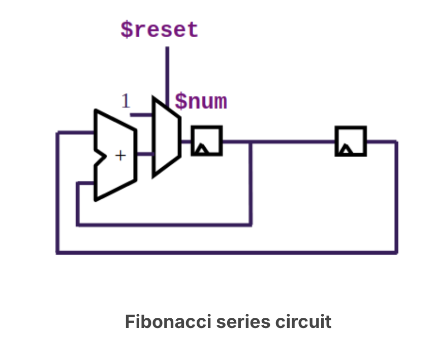
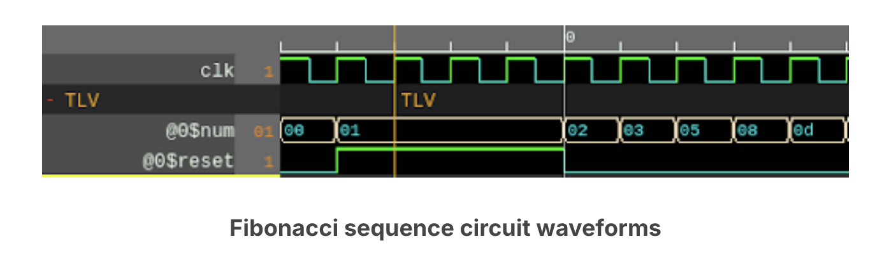
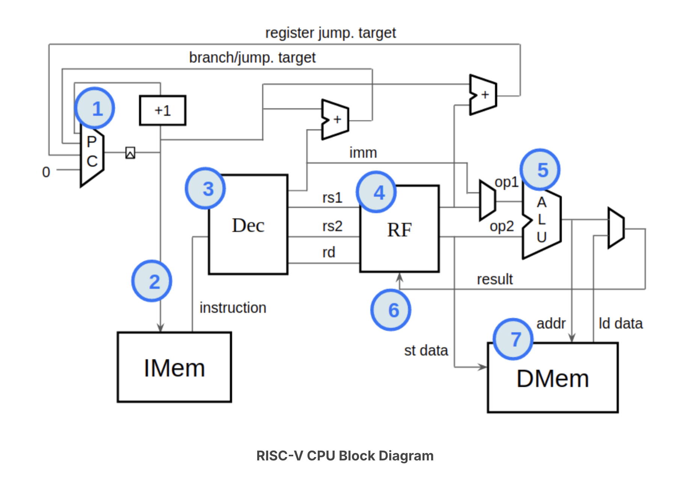

# Build RISC-V

## Logic gates

- In digital circuits wires stabilise to one of the two voltages: a high voltage (VDD)
or a low voltage (VSS or ground). So, a wire(bit) carries a boolean value, where high and low
voltages can be viewed as 1/0, true/false, asserted/deasserted, on/off, etc.

> Note:
> - The small circle on the output of a gate indicates an inverted output.
> - XOR and XNOR are "exclusive" OR and NOR, where "exclusive" means "but not both".

## Aritmetic Logic

- While individual wires (or "bits") hold one of two values in a digital circuit, we can
have a collection of N wires (called a "vector") that represent up to 2^N possible values.

## Clock and Flip-Flops

Sequential logic introduces a clock signal.

- The clock is driven through the circuit to flip-flops which sequence the logic.
- Flip-flops come in various flavors, but the simplest and most common is "positive-edge-triggered
D-type flip-flop".
- These drive the value at their input to their output, but only when the clock rises.
- They hold their output value until the next rising edge of their clock input.

### Sequencial circuit

- Unlike a combinational circuit, where output values are purely a function of the input values,
sequential circuits have internal state.
- Every sequential circuit needs the ability to get to a known "reset" state.
- Therefore, every sequential has a reset signal.

- While $reset is asserted, a 1 value is driven into $num.

## Software, Compilers and CPUs

- **Instruction Set Architecture (ISA)** - The ISA defines the programmer-visible behavior of the 
machine—its instructions and their encodings, registers, and rules of execution (plus memory/privilege
model) — independent of implementation.
- The ISA deines a human-readable form of every instruction, as well as the mapping of those *assembly*
instructions into bits.
- A **compiler** does the job of translating a program's source code into a binary file or executable
containing machine instructions for a particular ISA.
- An **Operating System** does the job of loading the binary file into the memory for execution by the
CPU hardware that understands the ISA.

## RISC-V

> # ISA (Instruction Set Architecture) — RISC-V Cheat Sheet (RV64I focus)
>
> ## TL;DR
>
> * **Where do instructions live?** In **memory**. The CPU **fetches** them at the address in **`pc`**.
> * **Where does the ISA “live”?** In the **spec** (a document). Hardware and emulators **implement** it.
> * **What does the ISA do?** Defines the **software-visible contract**: registers, instruction encodings & semantics, traps, memory/privilege rules. It does **not** dictate microarchitecture or the OS/ABI.
>
> ## Mental model (fetch → decode → execute)
>
> 1. **Loader/OS (once):** puts your program in memory and sets initial state (`pc`, stack pointer, etc.).
> 2. **Runtime (every instruction):** **Fetch** 32 bits at `pc` → **Decode** fields (`opcode`, `rd`, `rs1`, `rs2`, `funct3`, `funct7`, immediate) → **Execute** (read regs, ALU/mem op, write result) → **Update `pc`** (sequential or branch/jump).
>
> * **Invariant:** **`x0` is always 0** (writes ignored).
>
> ## What the ISA defines
>
> * **Programmer’s model:** 32 integer regs `x0..x31` (RV64I ⇒ 64-bit), `pc`.
> * **Encodings & formats:** R/I/S/B/U/J layouts; how to rebuild **immediates** (usually sign-extended).
> * **Semantics:** exact effects (e.g., **`JALR` clears bit 0** of the target).
> * **Exceptions/traps:** illegal instruction, misaligned access, etc.
> * **Memory rules:** little-endian in practice; memory ordering model.
> * **Privilege model (privileged spec):** M/S/U modes, CSRs, interrupts, paging.
>
> ## What the ISA doesn’t define
>
> * **Microarchitecture:** pipelines, caches, branch predictors, OOO, etc.
> * **ABI/OS:** calling conventions, ELF, syscalls (that’s ABI/OS territory).
>
> ## RISC-V specifics you’ll use immediately (RV64I)
>
> * **Register width:** 64-bit (`XLEN=64`). **Base instruction width:** 32-bit.
> * **Opcode vs funct fields:** `opcode` = class; `funct3`/`funct7` refine the op (e.g., `ADD` vs `SUB`).
> * **Immediates:** sign-extended; B/J are PC-relative with split fields (effectively **<<1**).
> * **`JALR` gotcha:** target address **bit 0 forced to 0**.
> * **Loads/stores:** addr = `rs1 + imm`. `LD/SD` are 64-bit; `LWU` zero-extends to 64; `LW` sign-extends to 64.
> * **`x0`:** hard-wired zero (great for moves/clears/comparisons).
>
> ## ISA vs Microarchitecture vs ABI vs OS (one-liners)
>
> * **ISA:** what the machine **means** to software (contract).
> * **Microarchitecture:** how the CPU **implements** that contract.
> * **ABI:** how programs **call** each other/OS (calling conv., object format).
> * **OS:** loads programs, manages resources, handles syscalls/interrupts.
>
> ---
>
> # How a CPU “knows” the ISA (RISC-V)
>
> **One instruction, concretely**
>
> 1. **Fetch:** read 32-bit instruction at `pc`.
> 2. **Field split:** wire slices → R-type layout: `[31:25 funct7][24:20 rs2][19:15 rs1][14:12 funct3][11:7 rd][6:0 opcode]`.
> 3. **Decode (pattern match):** hardwired logic (or microcode) checks fields, e.g.: `opcode=0110011`, `funct3=000`, `funct7=0000000` → **ADD**; same but `funct7=0100000` → **SUB**.
> 4. **Immediate gen:** rebuild & **sign-extend** immediates (I/S/B/U/J); B/J are PC-relative (<<1). **`JALR` clears bit 0.**
> 5. **Datapath:** regfile reads `rs1`/`rs2` → ALU/memory does the op → writeback to `rd` (except `x0`).
> 6. **PC update:** `pc+=4`, or branch/jump target as defined.
> 7. **Trap if required:** illegal opcode, misaligned access, etc.
>
> **Two common decoder styles**
>
> * **Hardwired decode:** combinational logic or PLA asserts control lines from `(opcode, funct3, funct7, …)`.
> * **Microcode:** index a tiny ROM of “control words” to step the datapath (less common for simple RISC-V cores).
>
> ---
>
> # Decoder wiring vs masks & shifts (emulator vs hardware)
>
> **Big idea**
>
> * The **ISA is a spec** (contract).
> * **Hardware** embodies it with **wires & logic** that recognize bit patterns and drive the datapath.
> * An **emulator** mimics that with **bit masks, shifts, and match tables** in software.
>
> **Caveats**
>
> * The ISA isn’t “stored in wires”; the **decoder** implements it.
> * Hardware typically doesn’t “shift” to decode; it uses **fixed bit slices** (wiring).
> * Many RISC-V cores are **hardwired decoders**; microcode is another valid approach.
>
> **Rule of thumb**
>
> * **Spec:** defines patterns & meanings.
> * **Hardware:** pattern match → control signals.
> * **Emulator:** masks/shifts/tables → same outcome.
>
> **Example: distinguishing `ADD` vs `SUB` (R-type)**
>
> * Same `opcode = 0110011`, same `funct3 = 000`.
> * **`funct7`** differentiates: `funct7 = 0000000` → **ADD**; `funct7 = 0100000` → **SUB**.

---

> # Program → Compiler → Assembler → Linker → OS/Loader → CPU (RV64I focus)
>
> ## Big Picture (High → Low)
>
> * **Program (Rust/C)** → **Compiler (target `rv64i`)**: chooses only **RV64I** instructions; if an operation isn’t in RV64I (e.g., `mul` without **M**), emits a **call to a helper** function instead of a single instruction.
> * **Assembler**: converts mnemonics into the exact **32-bit machine encodings** (fills `opcode`, `funct3`, `funct7`, registers, immediates).
> * **Linker**: stitches objects + libraries, resolves symbols, pulls in helper routines (e.g., `__muldi3`).
> * **OS/Loader**: loads the ELF into memory, sets up registers/stack, sets **`pc = entry_point`**. No translation of instructions.
> * **CPU (runtime)**: **Fetch** 32 bits at `pc` → **Decode** fields → **Execute** (regfile/ALU/memory) → **Update `pc`**.
>
> ## How many base instructions?
>
> * **RV32I**: **40** instructions (current spec).
> * **RV64I**: **RV32I + 12** = **52** total (adds 64-bit loads/stores and the *W* arithmetic/shift family, plus `LWU`).
>
> ### RV32I (40), grouped
>
> * **U-type (2):** `LUI`, `AUIPC`
> * **Jumps (2):** `JAL`, `JALR`
> * **Branches (6):** `BEQ`, `BNE`, `BLT`, `BGE`, `BLTU`, `BGEU`
> * **Loads (5):** `LB`, `LH`, `LW`, `LBU`, `LHU`
> * **Stores (3):** `SB`, `SH`, `SW`
> * **ALU-imm (9):** `ADDI`, `SLTI`, `SLTIU`, `XORI`, `ORI`, `ANDI`, `SLLI`, `SRLI`, `SRAI`
> * **ALU-reg (10):** `ADD`, `SUB`, `SLL`, `SLT`, `SLTU`, `XOR`, `SRL`, `SRA`, `OR`, `AND`
> * **Fence/System (3):** `FENCE`, `ECALL`, `EBREAK`
>
> ### RV64I adds (12)
>
> * **Word immediates (4):** `ADDIW`, `SLLIW`, `SRLIW`, `SRAIW`
> * **Word regs (5):** `ADDW`, `SUBW`, `SLLW`, `SRLW`, `SRAW`
> * **64-bit memory (3):** `LD`, `SD`, `LWU`
>
> ## Where do these “instructions” live?
>
> * **Spec (document):** The ISA defines encodings and semantics. That’s the *definition*.
> * **Hardware (CPU):** Usually **hardwired decode**—combinational **logic/wiring** recognizes `(opcode, funct3, funct7, …)` and drives the datapath (ALU, regfile, memory). Some CPUs use **microcode** (a tiny control ROM) for parts of the behavior.
> * **Toolchain software:** Assemblers/disassemblers/emulators keep **tables** mapping encodings ↔ operations (pure software data).
> * **Bottom line:** The ISA isn’t “stored” as a list inside the CPU; it’s **implemented** by decoder/control logic. Your program’s instructions themselves are stored in **memory** and fetched via **`pc`**.
>
> ## How the CPU interprets an instruction (concrete)
>
> 1. **Fetch**: read 32-bit word at `pc`.
> 2. **Field split** (wired slices). R-type layout: `[31:25 funct7][24:20 rs2][19:15 rs1][14:12 funct3][11:7 rd][6:0 opcode]`.
> 3. **Decode (pattern match)**: e.g., `opcode=0110011`, `funct3=000`, `funct7=0000000` → **ADD**; same but `funct7=0100000` → **SUB**.
> 4. **Immediate gen**: rebuild & **sign-extend** (I/S/B/U/J). **B/J** are PC-relative (effectively `<< 1`). **`JALR` forces bit 0 of the target = 0.**
> 5. **Execute**: regfile reads `rs1/rs2` → ALU/memory op → write `rd` (except `x0`, always 0).
> 6. **PC update**: normally `pc += 4`; branches/jumps override with target.
> 7. **Traps**: illegal instruction, misaligned access, etc., as defined by the ISA.
>
> ## If the ISA lacks an operation (example: `x * y` on RV64I without M)
>
> * The compiler emits a **call** to a helper like `__muldi3` (from runtime libs).
> * That helper is a **sequence of RV64I** instructions (e.g., shift-and-add loop).
> * Result: your binary still contains **only RV64I** encodings—just more of them.
>
> ## Key gotchas to remember
>
> * **`x0` is always 0** (writes ignored).
> * **Base instruction width is 32-bit** (even on RV64); `C` adds optional 16-bit encodings.
> * **Immediates** are generally **sign-extended**; **B/J** are **PC-relative**.
> * **`JALR` clears bit 0** of the computed target address.
> * **Opcode vs funct fields**: `opcode` = class; **`funct3/func7` refine** the exact operation (e.g., `ADD` vs `SUB`).
>
> ## One-liner glossary
>
> * **ISA:** software-visible contract (encodings + semantics).
> * **Microarchitecture:** internal implementation of that contract (pipelines, caches, etc.).
> * **ABI:** calling conventions, object format, syscalls.
> * **OS/Loader:** loads program, sets registers/`pc`, then CPU runs.
>
> ## Rule of thumb (toolchain roles)
>
> * **Compiler** = decides **which** instructions to use (and may output assembly or object code).
> * **Assembler** = turns mnemonics into the exact **32-bit encodings** (the bits on the wire).
> * **Linker** = connects pieces, pulls in helpers, fixes addresses.
> * **OS/Loader** = maps into memory and starts execution.

---

- RISC-V instructions may provide the following fields:
    - **opcode** - provides a general classification of the instruction and determines which of the 
    remaining fieldsare needed and how they are laid out, or encoded, in the remaining instruction bits.
    - **function field (func3/func7)** - specifies the exact function, if not fully specidied by the 
    opcode.
    - **rs1/rs2** - the indices (0-31) identifying the register(s) in the register file containing the
    source operand values on which the instruction operates.
    - **rd** - the index (0-31) of the register into which the instruction's result is written.
    - **immediate** - a value contained within the instruction bits themselves. This value may provide an
    offset for indexing into memory or a value upon which to operate (in place of the register value 
    indexed by rs2).

---

> # What is an **immediate** in RISC-V?
>
> **Plain English:** an *immediate* is a small constant **embedded inside the instruction bits**. It travels with the instruction so the CPU doesn’t have to fetch that constant from memory or a register.
>
> ---
>
> ## Why immediates exist
>
> * **Fast constants:** put `5` right in the instruction instead of loading it from memory.
> * **Addressing:** add a small **offset** to a base register to reach a field/array element.
> * **Control flow:** encode a **PC-relative offset** for branches/jumps.
> * **Building big constants:** use upper-immediate forms to assemble 32/64-bit values in a few instructions.
> * **Shifts:** encode the **shift amount** directly in the instruction.
>
> ---
>
> ## Where immediates appear (by instruction format)
>
> **I-type (12-bit signed, usually −2048..+2047)**
>
> * Used by: `ADDI`, `SLTI`, `SLTIU`, `XORI`, `ORI`, `ANDI`, **loads** (`LB/LH/LW/LBU/LHU` on RV32; + `LD/LWU` on RV64), `JALR`, `ECALL/EBREAK`, and **shift-immediates** (`SLLI/SRLI/SRAI`).
> * Meaning:
>
>   * ALU-imm: constant operand (e.g., `ADDI x1,x0,5`).
>   * Loads: **displacement** added to base register (e.g., `LW x3,12(x4)`).
>   * `JALR`: **offset** added to `rs1` to form the jump target (then **bit 0 of target is forced to 0**).
>   * Shifts: immediate is **shamt** (shift amount) — **not sign-extended**; width = 5 bits on RV32, **6 bits on RV64**; for `*IW` shifts (RV64) shamt is **5 bits**.
>
> **S-type (12-bit signed)**
>
> * Used by: **stores** `SB/SH/SW` (+ `SD` on RV64).
> * Meaning: **displacement** added to base register for the store address (e.g., `SW x5,−8(x2)`).
>
> **B-type (branch offset, signed, encoded with bit-splitting)**
>
> * Used by: `BEQ`, `BNE`, `BLT`, `BGE`, `BLTU`, `BGEU`.
> * Meaning: **PC-relative offset** to add to the current `pc` **if branch is taken**.
>   Encoding stores the offset **without bit 0** (targets are at least 2-byte aligned), so hardware **reassembles then << 1**.
>
>   * Practical range: about **±4 KiB** from the branch (step size 2 bytes).
>
> **U-type (upper 20 bits)**
>
> * Used by: `LUI`, `AUIPC`.
> * Meaning:
>
>   * `LUI rd,imm20` → `rd = imm20 << 12` (sets the upper bits; lower 12 are zeros).
>   * `AUIPC rd,imm20` → `rd = pc + (imm20 << 12)` (PC-relative base to build addresses).
>
> **J-type (jump offset, signed, bit-split)**
>
> * Used by: `JAL`.
> * Meaning: **PC-relative offset** to add to `pc` (**<< 1** after reassembly); also writes return address `pc+4` into `rd`.
>
>   * Practical range: about **±1 MiB** from the jump (step size 2 bytes).
>
> ---
>
> ## Sign extension rules (the default)
>
> * **Signed immediates:** I, S, B, J are **sign-extended** to XLEN before use.
> * **U-type:** forms a value by **placing bits in the upper 20** (no sign-extend).
> * **Shift immediates:** treat as **unsigned shamt** (width depends on RV32/RV64; `*IW` uses 5 bits).
>
> ---
>
> ## Quick examples (RV64 flavor)
>
> * **Small constant:** `ADDI x10,x0,5` → `x10 = 5`.
> * **Addressing:** `LD x6,24(x8)` → load from `x8 + 24`.
> * **Store:** `SD x7,-16(x2)` → store `x7` to `x2 - 16`.
> * **PC-relative jump:** `JAL x1,128` → `x1=pc+4; pc=pc+128`.
> * **PC-relative base:** `AUIPC x3,0x12345` → `x3 = pc + 0x12345_000`.
> * **Build big constant:** `LUI x5,0x7FFFF; ADDI x5,x5,-1` → upper then adjust low bits.
> * **Shift:** `SLLI x4,x4,3` → `x4 <<= 3` (shamt is 3).
> * **Branch:** `BEQ x1,x2,-16` → if equal, `pc = pc - 16` (offset reassembled, sign-extended, then <<1 in hardware).
>
> ---
>
> ## Mental model to keep
>
> * An **immediate** is just “**a constant packed into the instruction**.”
> * It can play **five roles**: constant operand, memory displacement, PC-relative offset, upper-bits builder, or shift amount.
> * **Most** immediates are **signed**; **shifts and U-type** are the main exceptions.
>
> ---
>
> ### One-question check
>
> For `ADDI` (I-type), what’s the valid **signed** immediate range you can encode?

1. **PC Logic** - responsible for the program counter (PC). The PC identifies the instruction our CPU will
execute next. Most instructions execute sequentially, the PC increments to the following instruction
each clock cycle. Jumps are not sequential and specify a target instructiont to execute next and the PC
logic must update the PC accordingly.

2. **Fetch** - pull the instruction pointed to by the PC.

3. **Decode Logic** - once we have an instruction we must decode it. We break it into fields based on its
type. These fields tell us which registers to read, which ops to perform, etc.

