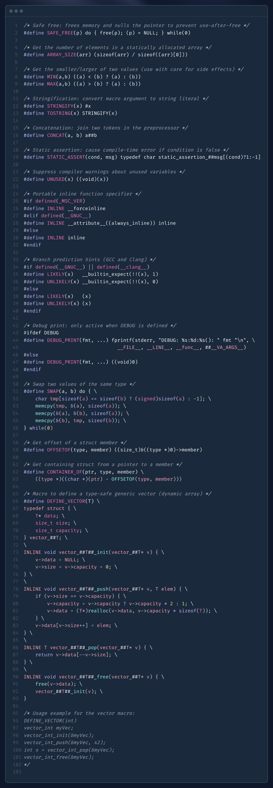

# C Programming

## LowLevelCode Zero2Hero C course

### Compilation Process

The process of converting source code to machine code is the following steps.

- Preprocessor
- Compilation
- Assembly
- Linking

### Strings

Strings are special. A string in C has a very special characteristic that makes it amazing, but also dangerous. 
All strings in C are ended with a null byte. If they don't end in a null byte, the operation you'll performing will complete going.

Why does that matter? If you run operations like strcpy, which copies data from the src buffer to the dest buffer. 
It will ONLY STOP COPYING OR PRINTING IF IT ENCOUNTERS THAT ZERO BYTE. So, the code above actually has a pretty major security vulnerability. 
You have to make sure your strings end with a zero, otherwise things will go sideways.

### Union

Unions are a field that assign multiple labels of multiple types to the same memory location.

You can create a structure with the following syntax.

```c
union myunion {
    int i;
    char c;
};
```

This will create a type called union myunion that we can use later on in the code. 
This structure has two members i and c, but both of them will contain data at the same location. 
The union is only the size of the largest element, in this case int i, or 4 bytes.

```c
union myunion {
    int i;
    char c;
};

int main() {
    union myunion u;
    u.i = 0x41424344;
    printf("%c"\n, u.c); 
    ...
}
```

Above, u.c will equal 0x44, which is the value in the location of i.

## Cheatsheet

  

## Data Types

- char c = 'A'; // single character | 1 byte (-128 to 127) | unsigned char (0 to 255)
- char str[] = "Hello"; // array of characters | string

- float f = 3.14; // 4 bytes (32 bits of precision) | 6-7 decimal digits | loses precision after 7 digits
- double d = 3.14; // 8 bytes (64 bits of precision) | 15-16 decimal digits | loses precision after 16 digits

- bool b = true; // 1 byte (0 or 1) | true or false | need to include stdbool.h

- short int si; // 2 bytes (-32,768 to 32,767)
- unsigned short int usi; // 2 bytes (0 to 65,535)

- int i; // 4 bytes (-2,147,483,648 to 2,147,483,647)
- unsigned int ui; // 4 bytes (0 to 4,294,967,295)

- long long int lli; // 8 bytes (-9,223,372,036,854,775,808 to 9,223,372,036,854,775,807)
- unsigned long long int ulli; // 8 bytes (0 to 18,446,744,073,709,551,615)

- defining a constant is done by using the const keyword

- Math library (#include <math.h>, compile with -lm) prefers double.

    const float PI = 3.14;

| Name      | Size    | Description                                           |
|-----------|---------|-------------------------------------------------------|
| char      | 1 byte  | an ASCII value: e.g. 'a' (see: man ascii)             |
| int/long  | 4 bytes | a signed integer: e.g. 97 or hex 0x61, oct 0141       |
| long long | 8 bytes | a longer multi-byte signed integer                    |
| float     | 4 bytes | a floating-point (possibly fractional) value          |
| double    | 8 bytes | a double length float                                 |

## Casting

Preceding a primitive expression with an alternate parenthesized type converts or "casts" value to a new value equivalent in new type:

```c
int a = (int) 3.131;   //assigns a=3 without complaint
```

Preceding any other expression with a cast forces new type for unchanged value.

```c
double b = 3.131;
int a = *(int*)&b; //interprets the double b as an integer (not necessarily 3)
```

## STRUCTS and ARRAYS and POINTERS and ADDRESS COMPUTATION:

### Structs

Collect several fields into a single logical type:

```c
struct { int n; double root;} s; //s has two fields, n and root
s.root = sqrt((s.n=7)); //ref fields (N.B. double parens=>assign OK!)
```

Basic struct definition and initialization:

```c
struct Point {
    int x;
    int y;
};

struct Point p1 = {10, 20}; // Initialize at declaration
struct Point p2;
p2.x = 30;
p2.y = 40;

printf("p1: (%d, %d)\n", p1.x, p1.y);
printf("p2: (%d, %d)\n", p2.x, p2.y);
```

Nested structs:

```c
struct Rectangle {
    struct Point top_left;
    struct Point bottom_right;
};

struct Rectangle rect = {{0, 0}, {100, 100}};
printf("Rectangle: (%d,%d) to (%d,%d)\n", 
       rect.top_left.x, rect.top_left.y, 
       rect.bottom_right.x, rect.bottom_right.y);
```

Array of structs:

```c
struct Student {
    char name[50];
    int age;
    float gpa;
};

struct Student class[3] = {
    {"Alice", 20, 3.8},
    {"Bob", 22, 3.5},
    {"Charlie", 21, 3.9}
};

for (int i = 0; i < 3; i++) {
    printf("Student %d: %s, Age: %d, GPA: %.1f\n", 
           i+1, class[i].name, class[i].age, class[i].gpa);
}
```


