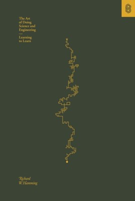
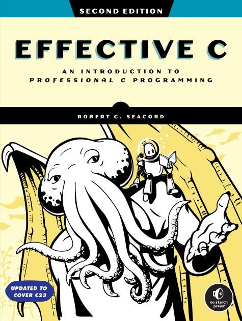

# Arc 2 Cracked - A Study Guide

## Path to Cracked

- [ ] Mathematics
- [ ] C Programming
- [ ] Data Structures and Algorithms
- [ ] Computer Architecture
- [ ] Operating Systems
- [ ] Compilers
- [ ] Theory of Computation
- [ ] Computer Networks
- [ ] Database Systems
- [ ] Blockchain
- [ ] Cryptography
- [ ] Machine Learning
- [ ] Deep Learning
- [ ] Robotics [OPTIONAL]
- [ ] Electrical Engineering [OPTIONAL]

## The Path

### Week 1

#### Mathematics

- Math Academy - (https://www.mathacademy.com/learn)

#### C Programming

- C Programming - Bro Code - (https://www.youtube.com/watch?v=87SH2Cn0s9A)
- The C Programming Language (2nd Edition) Brian W. Kernighan, Dennis M. Ritchie

#### Books

- The Art of Doing Science and Engineering: Learning to Learn - Richard Hamming

    

### Week 2

#### Mathematics

- Math Academy - (https://www.mathacademy.com/learn)

#### C Programming

- C Programming - Data Structures
- Effective C (2nd Edition) - Robert C. Seacord

#### Books

- Effective C (2nd Edition) - Robert C. Seacord

    

### Week 3

#### Mathematics

- Math Academy - (https://www.mathacademy.com/learn)

#### C Programming

- Low Level Academy - Zero2Hero 
- Effective C (2nd Edition) - Robert C. Seacord

#### Books

- Effective C (2nd Edition) - Robert C. Seacord

    