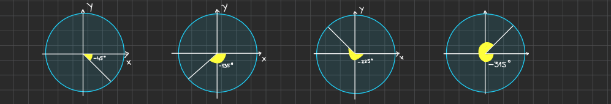

# Math

## Resources

- Coursera: Math for ML Specialization (https://www.coursera.org/specializations/mathematics-machine-learning)
- Discrete mathematics and its applications
- Some Fundamentals of Mathematics of Blockchain
- Professor Leonard (https://www.youtube.com/@ProfessorLeonard/playlists)

## Algebra II

### Imaginary Numbers

- to take the square root of a negative number, we need to expand our domain beyond the real numbers (integers, rationals, irrationals) to the realm of **imaginary numbers**

- the fundamental imaginary number is i, where i^2 = -1 => i = sqrt(-1)

### Negative Angles in the Coordinate Plane

- In the coordinate plane an angle theta in the standard position has its vertex (common endpoint of 2 rays that form an angle) at the origin (0,0) and the initial side on the positive x-axis, and it rotates such that a positive angle is measured counterclockwise and a negative angle is measured clockwise

- Example of representing angles when theta is -45 , -135 , -225 , -315 degrees

    

## Linear Algebra

### Vectors

#### Definition and Notation

- A vector is an ordered collection of numbers (called components or elements), which we often represent in a column form.

    $\mathbf{v} = \begin{pmatrix} v_1 \\ v_2 \\ \vdots \\ v_n \end{pmatrix}$

- In finance, you might have a vector of asset returns, e.g., $\mathbf{r} = (r_1, r_2, \ldots, r_n)^\top$

#### Basic Operations

1. Vector Addition

    $\mathbf{u} + \mathbf{v} = \begin{pmatrix} 
    u_1 + v_1 \\ 
    u_2 + v_2 \\ 
    \vdots \\ 
    u_n + v_n 
    \end{pmatrix}$

2. Scalar Multiplication

    $c \mathbf{v} = \begin{pmatrix} 
    cv_1 \\ 
    cv_2 \\ 
    \vdots \\ 
    cv_n 
    \end{pmatrix}$

where $c$ is a scalar.

3. Dot Product (inner product)

    $\mathbf{u} \cdot \mathbf{v} = u_1 v_1 + u_2 v_2 + \cdots + u_n v_n$

4. Norm (Length) of a Vector

- The most common is the Euclidean norm:

    $\|\mathbf{v}\| = \sqrt{\mathbf{v} \cdot \mathbf{v}} = \sqrt{v_1^2 + v_2^2 + \cdots + v_n^2}$

- In finance, norms and distances can be important for measuring errors or distances between return profiles, but more commonly used is the notion of variance and covariance (see below).

