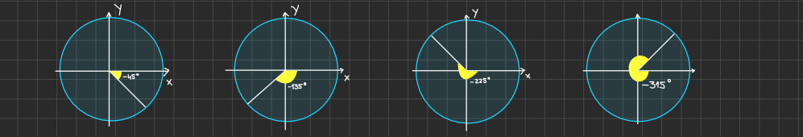

# Algebra II

## Imaginary Numbers

- to take the square root of a negative number, we need to expand our domain beyond the real numbers (integers, rationals, irrationals) to the realm of **imaginary numbers**

- the fundamental imaginary number is i, where i^2 = -1 => i = sqrt(-1)

## Negative Angles in the Coordinate Plane

- In the coordinate plane an angle theta in the standard position has its vertex (common endpoint of 2 rays that form an angle) at the origin (0,0) and the initial side on the positive x-axis, and it rotates such that a positive angle is measured counterclockwise and a negative angle is measured clockwise

- Example of representing angles when theta is -45 , -135 , -225 , -315 degrees

    